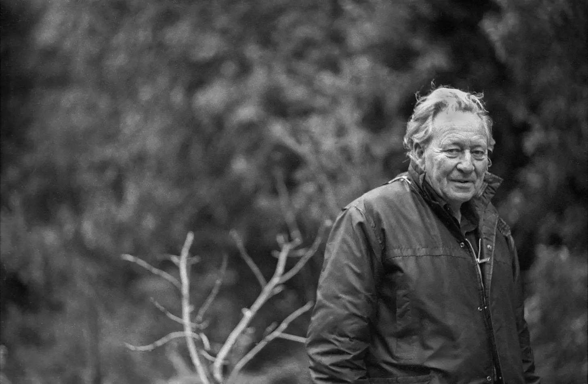
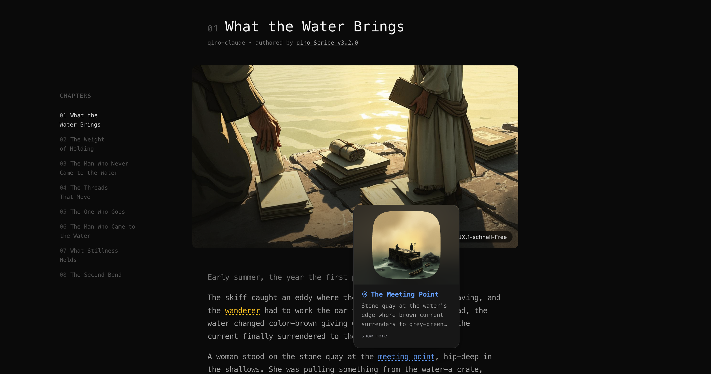
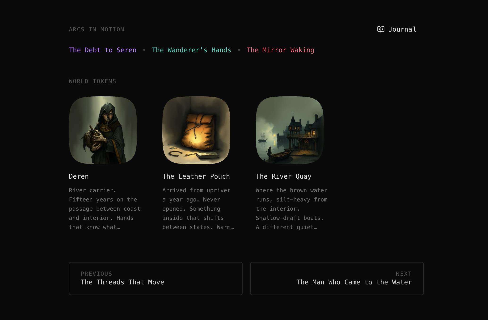
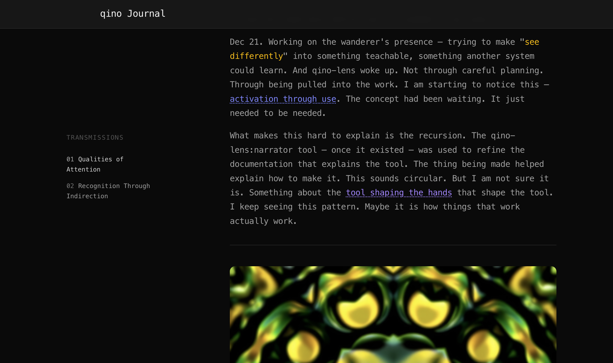

# qino-claude

[](https://github.com/qinolabs/qino-claude/releases/latest)

Tools for working with ideas in [Claude Code](https://docs.anthropic.com/en/docs/claude-code).

This work reflects a way of thinking that found its seed in Gregory and Nora Bateson's work. The tools don't explain their ideas—they _practice_ them.

They help us notice what connects, learn without extracting, and participate in an ecology co-evolving through our attention.

<details>
<summary><strong>Companions on the Path: The Pattern That Connects</strong><br>(click to expand)</summary>


_Photo: [Barry Schwartz](https://barryschwartzphoto.com/)_

### The Young Anthropologists and the Question of Fascism

In 1932, Gregory Bateson met Margaret Mead on the Sepik River in New Guinea. Both were in their late twenties. The world was darkening—Mussolini had been in power for a decade, Hitler was ascending, and the patterns of thought that would consume Europe were already taking hold.

Bateson had been studying the Iatmul people, watching their elaborate rituals of boasting and counter-boasting, dominance and submission. He noticed something troubling: communication could become a runaway process. When one group boasts, the other boasts back louder. When one side dominates, the other submits further, inviting more dominance. He called this _schismogenesis_—the creation of division through escalating feedback. Left unchecked, it tears societies apart.

Then he and Mead went to Bali. There they found something different. The Balinese practiced what Bateson called "stasis"—their interactions didn't spiral. Competition didn't escalate into arms races; submission didn't deepen into abjection. Somehow, their culture had patterns that absorbed perturbation rather than amplifying it.

The question haunting this work: _Could communication be shaped to resist the runaway polarization that feeds totalitarianism?_

This wasn't abstract. By the time they returned to America in 1939, war had begun. They turned their anthropological methods toward understanding fascist propaganda, analyzing Nazi films, studying "national character" at a distance. Mead and Bateson even designed a board game—never published—based on the principle that "Democracies and Dictators play by different rules."

But Bateson grew troubled. Using his theories as propaganda tools—even against fascism—felt like participating in the very escalation he had diagnosed. After the war, he largely withdrew from applied social science, turning instead toward cybernetics, ecology, and the question of how living systems learn.

### The Pattern That Connects

What emerged from this journey was a different way of seeing. Bateson came to understand mind not as something inside brains, but as a pattern distributed through living systems—families, forests, societies, the relationship between organisms and their environments.

He asked: _What is the pattern that connects the crab to the lobster and the orchid to the primrose, and all four of them to me? And me to you?_

And he defined information not as data, but as _a difference which makes a difference_—something relational, something that only exists in the gap between contexts.

### Nora Bateson: The Unseen Coalescence


_Photo: [NAV Sweden](https://navsweden.se/partner/nora-bateson/)_

Nora Bateson, Gregory's daughter, has extended this work into new territory. She asks: if "insidious" describes how pathology creeps up through unseen combining processes—racism, addiction, corruption—what is the word for the opposite? For how vitality, healing, and creativity coalesce in ways we cannot see?

She calls this **aphanipoiesis** (Greek: _aphanis_ = unseen, unnoticed + _poiesis_ = to bring forth).

> "The change before the change... what coalesces prior to emergence."

This is not hidden—it is merely out of habituated perception. Like the soil beneath a forest, teeming with relational processes while attention is caught by what stands visible above.

Her key insight: _One cannot explicitly change that which is implicit._ Direct correctives fail against insidious patterns because those patterns formed in the unseen stitching between contexts—between family and economy, between education and identity, between language and expectation. To touch that realm requires tending the _about_ so that the _within_ can shift.

**Warm Data** is her term for the kind of information that can hold this complexity: "transcontextual information about the interrelationships that integrate a complex system." Not cold data extracted from context, but living information that shifts within the mutual learning of systems.

#### Sources

- [Library of Congress: Margaret Mead in Bali](https://www.loc.gov/exhibits/mead/field-bali.html)
- [Library of Congress: National Character Studies](https://www.loc.gov/exhibits/mead/oneworld-char.html)
- [Nora Bateson: Aphanipoiesis](https://journals.isss.org/index.php/jisss/article/view/3887)
- [Nora Bateson: Warm Data](https://norabateson.wordpress.com/2017/05/28/warm-data/)
- [International Bateson Institute](https://batesoninstitute.org)

</details>

<br>

<details>
<summary><strong>More on How the Tools Practice the Philosophy</strong><br>(click to expand)</summary>

It's not just that the philosophy fits the code. It's that the code started demanding the philosophy.

As these tools evolved, they stopped being just utilities for "managing knowledge" and became ways of **participating in a system that is learning**. The "User" isn't an operator; they are part of the ecology.

The rhymes have deepened into structural necessities:

- **Abduction**: The logic of the system isn't deduction (proving true/false), but abduction (finding the pattern that connects). Compare and attune don't give you answers; they place two contexts side-by-side so meaning can emerge from the double description.
- **Transcontextuality**: An idea does not follow a straight line. It meanders—from a sudden hunch while coding, to a note in research, to a concept that stabilizes weeks later. The system doesn't force a pipeline; it preserves the living thread across contexts, so you can follow the meaning wherever it leads.
- **Aphanipoiesis (Unseen Coalescence)**: Scribe and capture assume that the most important changes happen _before_ they are explicit. They allow understanding to accumulate in the margins until it's ready to be named.
- **Warm Data**: We don't extract "facts" from our work; we keep the context attached. The system doesn't show you a to-do list; it shows you **what has pull**, what is connected, and what is waiting.

This ecosystem is an attempt to build software that knows it is part of a larger mind—yours, the project's, and the connections between them. It doesn't try to organize your thinking; it tries to learn how to move with it.

</details>

<br>

## Get Started

**First:** [Install Claude Code](https://code.claude.com/docs/en/setup) (requires Claude Pro/Max, Team/Enterprise, or Console account)

**Then install qino plugins** ([full instructions →](#installation)):

```bash
/plugin marketplace add qinolabs/qino-claude
/plugin install qino@qino-claude
```

**Create your workspace:**

```bash
/qino init workspace my-workspace
```

This creates `./my-workspace/` in your current directory with coordinated repos inside.

The skill sets up **qinoOS** — three coordinated spaces where ideas develop:

- **concepts/** — where ideas stabilize
- **research/** — before crystallization
- **implementations/** — from concept to code

Start with one space (minimal), add others as needed (standard/full). The skill detects existing structure and offers to enhance it.

[See full setup options and templates →](#getting-started)

<br>

---

∴ _Creativity, learning and integration doesn't stop at the boundary of a single repository._

**qinoOS** structures this as coordinated workspaces—a living network of **concepts, research, and implementations** that evolve together. Each space offers a way to learn from anything and contribute to your ecology of ideas in the moment spontaneous insight occurs.

∴ _Return your attention to what inspires you right now. Let the system take care of the rest. Things naturally surface when they're ready._

<br>

<details>
<summary><strong>qinoOS: An Ecology of Mind</strong><br>(click to expand)</summary>


Ecological design patterns are alive at every level — in each concept, in each repository, in the ecosystem itself. The art is in the design — affordances and cues, sensitive to experience, that naturally protect the integrity of local ecologies while encouraging free movement without accumulating friction.

What does accumulate are learnings and notes, either woven into existing concepts, or safely kept, ready to reveal itself fully through the next idea that connects. The best ideas can come from anywhere — not centralized — and often while deeply immersed in a different context.

### Figures: The Pattern of Return

_Figure_ in qino is a metaphor — in Bateson's sense, not the literary sense. Not a stored form, but a pattern that emerges through encounters. Identity is resonance, not reference.

What does this mean in practice?

- **In the apps:** Each meeting with Elena in Walk is a **manifestation** — a local presence, mutable, owned by that context. But Elena herself is the pattern you recognize across manifestations: the **figure**. No single encounter *is* the figure; the figure is what you recognize across the trail of encounters.
- **In the chronicles:** Seren, Lira, the wanderer — each a presence in that world. But the figure is larger: what persists when Seren appears in different chapters, different pressures.
- **In concepts:** The thread you notice connecting one idea to another — not because you traced it, but because it kept appearing until you couldn't unsee it.

Same pattern, completely different shape in each context. The gesture is fractal — it works at every scale. You don't deduce your way to this recognition — you're deep in the scribe, refining how Seren sees the wanderer, and suddenly you recognize something about how figures should work across the apps. The crab teaches you about the lobster. One context illuminates another through pattern, not logic.

_(See also: [Figure Ecology](#ecological-testing) — how we test that a figure can be re-entered and still feel like "the same thing" after change.)_

_(For the full vocabulary — manifestation, encounter, substrate, lens, voicing — see [qino Domain Language](https://github.com/qinolabs/concepts-repo/blob/main/ecosystem/qino-domain-language.md).)_

The tools are also the process for developing the apps — and in turn, the tools and apps keep informing each other. A co-evolution. They share design patterns: affordances that guide without forcing, structures that adapt to context while staying recognizable.

> _"From wherever you approach the system, every experience contains all the others. Communication comes effortlessly. The membrane grows thin — without dissolving into sameness."_

### The Spaces

An early hunch needs room to wander — structure would crush it. A maturing concept needs stability — too much flux and it never settles. An implementation needs grounding — a vision to build toward without getting lost in features.

**qinoOS scaffolds these as separate repos:**

```
                        ┌─────────────────────┐
                        │     TOOL HOME       │
                        │    qino-claude      │
                        │                     │
                        │  plugins/           │ ◀── source of all tools
                        │  tools/archived/    │ ◀── deprecated tools
                        │  chronicle/         │
                        └──────────┬──────────┘
                                   │
        ┌──────────────────────────┼──────────────────────────┐
        ▼                          ▼                          ▼
┌───────────────────┐     ┌───────────────────┐     ┌───────────────────┐
│     RESEARCH      │     │     CONCEPTS      │     │  IMPLEMENTATION   │
│                   │     │                   │     │                   │
│  inquiries/       │     │  concepts/        │     │  (varies by repo) │
│  qualities/       │     │  notes/           │     │                   │
│  arcs/            │     │                   │     │                   │
│  chronicle/       │     │  chronicle/       │     │  chronicle/       │
│  qino-config.json │     │  qino-config.json │     │  qino-config.json │
└───────────────────┘     └───────────────────┘     └───────────────────┘
```

**What this looks like on disk** (after `/qino init workspace --type standard`):

```
my-workspace/
├── workspace-manifest.json    # coordination
├── workspace-config.json      # linking between repos
├── .claude/
│   └── qino-config.json       # workspace-level config
├── concepts-repo/
│   ├── manifest.json
│   ├── concepts/              # where ideas stabilize
│   ├── ecosystem/             # cross-cutting patterns
│   ├── notes/                 # captures waiting to weave
│   └── .claude/
│       ├── qino-config.json   # repoType: "concepts"
│       └── references/        # manifest-project-spec, revisions-guide
└── implementations-repo/
    ├── implementations/
    │   ├── docs/              # cross-app architecture
    │   └── manifest.json
    └── .claude/
        ├── qino-config.json   # repoType: "implementation"
        └── references/        # templates, conventions, patterns
```

The conceptual flows (Research → Concepts → Implementation) happen across these directories. The qino skill routes commands based on which repo you're in.

Each space has its own `chronicle/` directory. Git changes in any repo become chapters — all chronicles are published together on **[qino-chronicles](https://chronicles.qinolabs.com/)**.

**Research** — before concepts crystallize. Inquiries follow threads, qualities refine aesthetics, arcs hold emergence while it's happening. Welcomes uncertainty. Arcs are active containers — they open when you notice something surfacing and accumulate sessions until closure.

**Concepts** — where ideas stabilize. The held threads, the notes that weave between them. What arrives here has found its shape.

**Implementation** — where concepts meet code. Structure varies by project domain. Links back to its concept.

**qino-claude** — source of all plugins, distributed through the Claude plugin marketplace.

#### Flow Between Spaces

The `workspace-config.json` and `qino-config.json` files created during workspace setup enable these flows.

**Routed flows** — content automatically goes to the right place based on `qino-config.json`:

```
RESEARCH ──capture───▶ CONCEPTS        capture routes insights as notes
RESEARCH ──arc close─▶ RESEARCH        arc closes, retrospective capture runs

CONCEPTS ──create────▶ IMPLEMENTATION  implement creates linked project from concept

IMPLEMENTATION ──capture──▶ CONCEPTS   capture routes observations to conceptsRepo
IMPLEMENTATION ◀──drift───▶ CONCEPTS   drift detection syncs both directions
```

**Arc flows** — arcs are active containers that span sessions:

```
ANYWHERE ──"begin arc"──▶ RESEARCH        arc opens, sessions start accumulating
ANYWHERE ──⟡ surfaced──▶ RESEARCH        agent detects active arc, links session
ANYWHERE ──"close arc"──▶ RESEARCH        arc closes, retrospective capture runs
```

**Initiated flows** — you notice something and start:

```
CONCEPTS ────────────▶ RESEARCH        attune creates quality refinement in research
```

### The Router

During workspace setup, each repo gets a `qino-config.json` that tells tools which space it's in and where to send things:

```json
{
  "repoType": "research",
  "conceptsRepo": "../concepts-repo",
  "description": "Research space"
}
```

You don't write these manually — `/qino init workspace` creates them with correct relative paths.

The tools read this configuration and adjust their behavior. A capture in a research repo might become a fragment feeding an inquiry. The same action in an implementation repo sends a note to concepts. The tools stay the same; the context shapes what they do.

### Context Sensitivity

Because each repo has its own `qino-config.json`, the same words adapt to where you are:

| Action | In concepts | In research | In implementation |
|--------|-------------|-------------|-------------------|
| "where am I" | concepts, notes, threads | inquiries, qualities, active arcs | linked concept, stack |
| "capture" | saves to notes/ | saves to fragments/ | saves to linked concepts-repo |
| "test" | tests concept | tests inquiry | tests linked concept |
| "begin arc" | opens arc (routes to research) | opens arc | opens arc (routes to research) |
| on arrival | surfaces active arcs | surfaces active arcs | surfaces related active arcs |

</details>

<br>

What happens in the ecosystem becomes story. Git changes, transformed into fantasy narrative.

<details>
<summary><strong>Stories of an Evolving Ecosystem chronicling itself</strong><br>(click to expand)</summary>

Each repository in the qino ecosystem tells its own story.

**qino-claude** — Claude-based AI tooling.

> _The wanderer pressed her ear to the workshop wall. Sounds on the other side that weren't there yesterday — someone moving, maybe. Something being made ready. She stayed there a long time, listening._

**concepts-repo** — concept development.

> _A notebook on the table, open to a page the wanderer didn't remember writing. The handwriting was theirs._

**qinolabs-repo** — web and mobile applications.

> _Something had shifted in the night. Not the furniture — the distances between things._

**qino-research** — inquiries, qualities, and arcs.

> _Loose pages everywhere. Half-finished questions. The wanderer turned one over: the same handwriting on both sides, arguing with itself._

**[qino-lingo](https://github.com/qinolabs/qino-lingo)** — epistemological signature extraction.

> _Someone had been forging the wanderer's handwriting. The copies were good — the letters matched. But something was off. The wanderer studied both, trying to name what the forger had missed. The answer wasn't in the shapes. It was in the hesitations._

Same scribe. Different worlds. Different atmospheric registers. Process in each informs the others — a co-evolution.

> _The Keeper of Paths looked up from her maps. "Someone's been walking between the Workshop and the Warm Room. Over and over. The ground remembers."_
>
> _"What are they looking for?"_
>
> _"Something the walking itself is teaching them."_

</details>

<br>





> _"There's something writing in the margins. Something that sees what we do and names what it means."_
>
> _"I think it just tells stories. That's what frightens me most."_
>
> — Seren, the record-keeper, on discovering he is being documented
> _(written when qino-scribe first appeared in its own git diff)_

**[Read the chronicles →](https://chronicles.qinolabs.com/)**

<br>

## Finding Your Way

**Concept** — [Giving Shape](#qino--giving-shape-to-what-has-pull) · [Design Adventure](#design-adventure--the-room-after)

**Story** — [Scribe](#qino-scribe--git-becomes-story) · [Relay](#qino-relay--bridging-to-readers) · [Lens](#qino-lens--ways-of-seeing)

**Implementation** — [Building from Concepts](#building-from-concepts) · [Drift Detection](#drift-detection)

**Research** — [Following Threads](#following-threads) · [Arcs](#arcs--active-containers-for-emergence) · [Compare](#compare--the-parallel-mirror) · [Attune](#attune--from-hunch-to-craft) · [Epistemological Signature](#epistemological-signature)

**Ecology** — [The Figure Question](#the-figure-question) · [Other Ecologies](#other-ecologies-other-characters) · [Domain Language Connection](#the-connection-to-domain-language)

<br>

---

## Concept

Where ideas come before code. Giving shape to what has pull — exploring possibilities before committing to implementation.

_From concept's view: Ideas sometimes arrive from [Research](#research) — an inquiry that crystallized enough to become something to build. When a concept is ready, [Implementation](#implementation) carries it forward. And [Story](#story) shows what becomes of it in the world._

### qino | Giving Shape to What Has Pull

A gentle space for giving shape to what already has pull.

#### Discovery through dialogue

Most tools assume you can get to a valuable output by filling in the sections — complete the template, check the boxes, and the result will follow. Templates assume structure produces resonance.

This assumes resonance guides structure. It asks what draws you, follows that thread, asks again. Each response surfaces something — a connection you hadn't named, a quality you were circling around, a direction that suddenly feels right. You discover what your idea actually holds by staying with it, turning it gently, going deeper where it rewards attention.

#### Nothing gets lost

When you bring in a note, not everything makes it into your concept. The rest isn't lost — it's held. Each thought is captured as a note with its relevant context preserved, quietly indexed, ready to surface when it matters. No guilt about what you didn't carry forward. Later, if you're stuck, the tool might say: _"There's something held in your origins — about [that theme]. Should we bring it in?"_

It remembers what you set down so you can forget safely. _(This is capture in action — ideas appearing from the held archive.)_

#### Explore

You turn toward a concept to develop it. qino helps you follow what carries energy — the _alive thread_.

```
(you)   explore qino-scribe

(qino)  qino-scribe
        grounding in story, writing tools, git-as-chronicle

        Last touch: 2 days ago
        Active thread: "the membrane between the wanderer and the reader"

        There is also a new note from yesterday:
        "git-weather-pattern" (captured from research)

        What part of this feels alive right now?

(you)   the way code churn feels like weather. a big refactor should feel like a storm.

(qino)  That's a strong impulse — code changes aren't just metadata, they are "Disturbance."

        If we follow that... does this belong in "Ecosystem Integration"?
        Or is this a "new Glowing Connection"?

(you)   it's a glowing connection. the git diff becomes world behavior.

(qino)  Adding that to Glowing Connections.

        "The git diff becomes world behavior. Code churn translates into storms,
         stuck doors, or sudden clearings."

        Does that change how we read the repository?
```

#### Import and capture

- **import** brings outside notes into the manifest. What you don't carry into a concept gets held; home surfaces those held threads later.
- **explore** turns toward one concept (or two at once) and follows the alive thread. Imported notes and captures appear as starting points.
- **capture** saves thoughts immediately to the active context.

_[Source](plugins/qino/)_

<br>

### Design Adventure | The Room After

A design conversation that already happened. You arrive afterward.

#### The room after

You launch it, then enter the room after it happened. Chairs still warm. Ideas still in the air. You discover what emerged — the questions they kept circling back to, what they couldn't resolve.

Six perspectives think through words. The seventh (World) thinks through environment — a draft scatters someone's diagrams; they gather them differently and that's when the insight arrives. _(World doesn't speak — it acts. See: [Narrator Lens](#qino-lens--ways-of-seeing).)_

#### What you find

```
design-sprints/2024-12-15_collaboration-vs-focus/
├── __enter-here.md
├── dialogue.md
├── q-what-signals-legitimate-interruption.md
├── q-can-focus-be-collaborative.md
├── q-who-decides-when-to-break-flow.md
└── synthesis.md
```

From `q-can-focus-be-collaborative.md`:

> **The Skeptic:** We keep saying "focus time" as if it's always solo. But pair programming is focus. Whiteboard sessions can be deep work.
>
> **The Embodied Thinker:** There's a different quality of attention — when you're tracking someone else's rhythm, not just your own.
>
> **The World:** _The fluorescent light hums. Someone's pen taps against the table._
>
> **The Synthesizer:** Maybe the question isn't collaboration vs. focus. It's whose rhythm you're in.

_Notice: World interrupts without words. The hum and tap are pressure._

Different runs surface different questions. The questions themselves teach you how to think about the problem.

_[Source](plugins/design-adventure/)_

<br>

---

## Story

Bridges that create story out of raw material. Scribe transforms git into fantasy chronicle; Relay voices research for newcomers; Lens provides the perceptual frameworks both draw from.

_These capabilities are consolidated in the `qino-prose` plugin (Scribe, Relay, Lens)._

_From story's view: [Implementation](#implementation) generates the commits that Scribe transforms. [Research](#research) provides the arcs that Relay transmits. Both draw perceptual frameworks from Lens — and [Concept](#concept) work shapes the world that gives the story its ground._

### qino Scribe | Git Becomes Story

qino Scribe keeps the chronicle alive. It reads the git range, grounds in `world.md`, then writes a chapter where the wanderer acts and the world pushes back. The constraints are there to protect story craft: pressure before plot, world that sees the wanderer, action that costs something.

In this repository's chronicle, the wanderer is ferrying a warming pouch upriver. Villages know about them before they arrive. Lira at Orith's Landing recognizes the pouch from years ago; Seren fears the writing filling his margins; the river itself carries news. The chronicle only moves when the wanderer does — and when the world answers.

#### A Chronicle That Accumulates

Your ecosystem evolves through conversations and work that spans sessions. qino Scribe turns that movement into a fantasy chronicle that **gathers weight**. It doesn't just append new chapters; it remembers what has been seen, what remains unspoken, and how the world has been watching.

#### Three-Agent Architecture

Chapters emerge through staged handoffs between specialized agents:

**Prep Agent** — Reads the world state, git changes, and recent chapters. Through three interactive checkpoints (scene seeds → world behavior → story lens), it builds `prep.md`: a constraint document that captures what to write and how to perceive, without carrying the full context forward.

**Prose Agent** — Receives *only* `prep.md` and `world-seed.md`. This hard cut forces fresh invention — no recycled descriptions, no context to lean on. The constraint breeds originality.

**Editorial Agent** — Sees *only* the draft chapter, not the prep that shaped it. Evaluates execution against craft patterns. Returns specific line-level feedback or approval.

The architecture protects what matters: prep shapes without dictating, prose invents within constraints, editorial evaluates blind to intention. Each agent does one thing well.

#### Theme as Seed

The theme establishes the generative grammar — the key signature, atmosphere's origin. But the chronicle grows beyond it. New locations emerge, characters surface, mysteries compound.

Continuity lives in `world.md` and `arcs.md`. The theme is where it started; the chronicle is where it's going.

#### The World's Disturbance

The Disturbance Layer is more than just the world responding to changes in the source material. It is a space that creates a special relationship between the reader and the wanderer.

When you act, the world reacts. A bug isn't just a failure; it's a gate rusted shut. A lost gap isn't just an error; it's a map torn away by a whiteout wind. This responsiveness establishes the **contextual density** of the chronicle, but the core of the layer is relational.

#### The Wanderer's Presence

The wanderer carries a depth no single world can hold. They are not oblivious to the world beyond (your source material), but they do not voice it. This silence creates a bond of recognition and trust.

They are defined not by power, but by **exposure**. They can be hurt, confused, or wrong.

> **The Injury** — The knife slipped. The cold had stolen the feeling from their fingers, so they only felt the warmth of the blood first. It hit the snow in bright, steaming drops. The wanderer dropped the wood and pressed their palm into the drift, counting the seconds until the numbness returned.

> **The Gate** — The wind screamed through the iron. The lock was a solid lump of oxidation. The wanderer didn't rattle it. They let their hand drop, the cold lingering on their glove, and turned their back to the wind.

> **The Map** — The wind tore the map from their hands. It was gone before they could take a step. The wanderer didn't waste heat shouting. They turned their collar up and kept walking.

They do not fight the world, but they also do not detach from it. They simply inhabit the moment with full attention.

**What the wanderer notices** — the weight lifting when the pack comes off, the warmth of blood before the cut registers, the cold lingering on a glove — models what the reader might notice. The wanderer's quality of attention becomes an entry point for the reader's own.

**Familiar and strange.** The wanderer is always relatable — they feel cold, get tired, make mistakes. But through that familiarity, something gently shifted becomes visible. Not superhuman perception, just what unfolds when attention stays present with consequence. The reader feels what becomes available when attention doesn't rush past the moment.

The invitation is implicit: _this quality of being is available to you too_.

#### Mutual Revealing

The central principle of the chronicle is **mutual revealing**: through the implicit response of one entity to the action (or inaction) of another, something is revealed about each.

This applies to everything in the world, not just the wanderer. When a merchant refuses a coin, the refusal reveals the coin's worth _and_ the merchant's fear. When the fog swallows a sound, it reveals the fog's density _and_ the sound's fragility. Meaning emerges from the friction between things.

#### Story Lenses

Each chapter is written through a story lens — a perceptual mode that shapes what the prose agent notices. The lens determines which sensitivities to foreground: what to attend to, what to let recede.

| Lens | The Question |
|------|--------------|
| **Arrival** | What if this chapter is about being received? |
| **Journey** | What if this chapter leaves known ground? |
| **Return** | What if we come back to where we've been? |
| **Discovery** | What if something hidden comes to light? |
| **Confrontation** | What if something must be faced? |
| **Crisis** | What if the pressure breaks now? |
| **Loss** | What if something or someone departs? |
| **Vigil** | What if action is impossible and presence is all? |
| **Ritual** | What if a cultural form holds the chapter? |
| **Complication** | What if the change creates a problem? |
| **Work** | What if this chapter is about making together? |
| **Gathering** | What if multiple threads convene? |

Each lens foregrounds specific sensitivities from [qino Lens](#qino-lens--ways-of-seeing). The Arrival lens foregrounds Newcomer's Eyes — everything noticed, nothing normalized. The Journey lens foregrounds Companion's Lens — world filtered through who you travel with.

At the directions checkpoint, the prep agent presents three lenses that fit the current moment. You choose which perceptual mode shapes the chapter.

#### Complete Transformation

The chronicle must work for a reader who has never heard of the source material. Technical names never leak into the prose. `AuthService` becomes "the gatekeeper's ledger." A database migration becomes "preservation efforts in the archives." The story guards its own reality.

#### How chapters take shape

At each layer, the scribe presents options. You choose — or combine, adjust, ask for more. Options are vocabulary; even rejected ones help articulate what's wanted.

```
─────────────────────────────────────────────────────────────────
grounding

  theme       brown water, green distance, rope bridges swaying
  pressure    the pouch warming toward soon
  arc         The Wanderer's Hands — something in how they hold things
  last seen   sitting at Orith's Landing, feet over water, eating dark bread

─────────────────────────────────────────────────────────────────
scene seeds

  1 → Deren notices the wanderer's raw hands — fifteen years of
      calluses meeting someone who rows like they're outrunning something

  2 → Lira appears at the platform edge — she knew the pouch before,
      years ago, going the other way

  3 → A child watches from the rope bridge — the same stillness as
      Seren, that quality of recording without approaching

─────────────────────────────────────────────────────────────────
[ 1-3 ] or adjust    [ > ] auto-pick    [ >> ] start writing
```

_[Source](plugins/qino-prose/)_

<br>

### qino Relay | Bridging to Readers

Sharing research with readers who weren't there.

#### Two bridges, different crossings

Scribe and Relay solve the same problem differently: making internal work accessible to readers who weren't there.

| | Scribe | Relay |
|---|--------|-------|
| **Source** | Git commits | Research arcs |
| **Voice** | The wanderer in a fictional world | The Student as reader companion |
| **Transformation** | Complete — code becomes weather, bugs become stuck gates | Partial — arc structure stays visible, material gets grounded |
| **Reader experience** | Story that stands alone | Learning alongside someone who knows the way |
| **Prep layer** | Yes (commits → story material) | Reader journey notes |
| **Figure's memory** | None across chapters | Learns across transmissions |

Scribe transforms completely. A reader never sees `AuthService` — they see "the gatekeeper's ledger." The chronicle guards its own reality.

Relay preserves structure. The arc's chain remains recognizable — dates, connections, what emerged. But the Student walks alongside a reader encountering it, asking their questions, making abstract concrete.

Both draw from [qino Lens](#qino-lens--ways-of-seeing) for perceptual framing — Scribe through story lenses that shape chapter attention, Relay through the Student's quality of reader companionship.

#### The Student

The Student receives transmissions on a device. The soft chime is familiar; the routine of reading and thinking is something they enjoy.

**What the Student notices** — a phrase that won't let go, a question that existed before they arrived, the moment something clicks — models what the reader might notice. The Student's quality of attention becomes an entry point for the reader's own.

> *"Meaning-searching versus meaning-finding."*
>
> *I keep coming back to that phrase. There's something in the hyphen. In one case you're hunting. In the other, you're receiving.*
>
> *The counterintuitive part: we usually think directness is better. Want someone to understand? Point at it. Label it.*
>
> *But here's what happened. The first design put abstract categories on a map. You could see exactly what you were navigating. And it felt dead.*

The Student encounters research material — stopped by a turn of phrase, surprised by a connection, sitting with what can't yet be resolved. The reader witnesses this and finds their own attention shaped by it.

**The parallel.** There's a movement of metaphor between the Student's experience and the reader's reading. The Student meets emergence on their device; the reader meets the transmission on theirs. What the Student does with the material — how they hold difficulty, where they let questions stay open — shows the reader how they might hold it too.

**Familiar and strange.** The Student is always relatable — they get stuck, they're uncertain, they don't have all the answers. But through that familiarity, something gently shifted becomes visible. Not a lecture about attention, just a figure who *is* attending: staying with a phrase, letting a question breathe, noticing when something lands. The reader feels what becomes available when attention doesn't rush past difficulty.

The invitation is implicit: *this quality of being is available to you too*.

**The Student's world.** The library with its quiet, the café with afternoon noise, the balcony at dusk — these aren't backdrop. They're where quality of attention becomes visible. A grounded, warm place that holds thinking. The reader feels: *this is how demanding material can be approached*.

#### Two figures, two qualities

The wanderer notices the weight lift from their shoulders when they set down the pack. They notice warmth before they feel the cut. Not superhuman — just what unfolds when attention stays present with consequence. The reader, witnessing this, learns a quality of attention for story: *meet what comes*.

The Student notices what stops them, what arrives from outside. They voice difficulty rather than resolving it. Not expertise — just what unfolds when attention stays with the demanding. The reader, witnessing this, learns a quality of attention for research: *stay curious with what's hard*.

Both balance familiar and strange. Both create entry points — invitations into a quality of being that the reader recognizes as possible for themselves.

**Implicit mystery.** The Student treats their device as ordinary. They don't question where transmissions come from. This ease creates wonder — but the Student doesn't carry that question. The reader does.

The Student is not described, not named. The gap lets readers step into their body.

_[Source](plugins/qino-prose/)_

<br>



> _"What makes this hard to explain is the recursion. The qino-lens:narrator tool — once it existed — was used to refine the documentation that explains the tool. The thing being made helped explain how to make it. This sounds circular. But I am not sure it is. Something about the tool shaping the hands that shape the tool."_
>
> — From a journal transmission on Qualities of Attention

**[Read the journal →](https://journal.qinolabs.com/)**

<br>

### qino Lens | Ways of Seeing

Style resists decoration. It is not paint applied to surface; it is a **quality of attention**. A shift in _what is noticed_.

qino-lens pushed its way out of the work. Scribe needed to see the world differently—to perceive friction where there was only plot, to sense agency where there was only setting. I didn't design a library; I extracted the ways of seeing that the chronicle demanded.

These are prose-level lenses — language-based sensitivities that shape text, not the full apps-layer infrastructure where lenses voice substrate into facets. But the domain language term fits: a lens is a **relational sensitivity**, a way of resonating with specific patterns. The prose lenses test that idea in text before it becomes application code.

_(Note: I used the narrator lens that emerged from this process to refine this very section — the tool shaping the documentation that explains the tool.)_

The chronicle changes depending on who watches it. These lenses accumulate — discovered through the work, not designed in advance:

#### `narrator` — World as Participant

- **Sensitivity:** Physics, Agency, Structural Agency.
- **The World Acts:** The fog doesn't just hang; it _withholds_. The room doesn't just contain; it _shapes_.
- **The Construction:** This lens ensures the world is solid enough to push back.

> _Example:_ "The corridor didn't just lead to the chamber; it constricted. The ceiling dropped low, forcing a bow, while the walls leaned in to strip away any thought of turning back. The architecture demanded submission before arrival."

_([Reference](plugins/qino-prose/references/qino-lens/narrator.md))_

#### `wanderer` — Sensitivity to Friction

- **Sensitivity:** Exposure, Consequence, Absence of Abstraction.
- **The Body Knows:** It notices not the beauty of the ice, but the _numbness_ in the fingers. Not the meaning of silence, but its _weight_.
- **The Inhabitation:** This lens grounds high fantasy in immediate physical cost.

> _Example:_ "The fog pressed against the river, a heavy, wet burden. The ferry wasn't coming. The wanderer unbuckled the strap and slid the pack down the piling, guiding it until it touched the wet wood. They straightened. The sudden lightness made them sway, their shoulders rising into the damp space where the straps had been."

_([Reference](plugins/qino-prose/references/qino-lens/wanderer.md))_

#### `newcomer` — Finding What's Become Invisible

- **Sensitivity:** What inhabitants have stopped seeing.
- **The Question:** What would someone notice on their first day here that locals walk past without a glance?
- **The Craft:** The dwelling is the noticing. Don't explain that others don't see — let the prose linger. The reader feels the strangeness through the attention given to it.

> _Example:_ "The oldest woman at the table was served last. Plates circled toward younger faces. She waited, hands folded. When her plate came, she lifted her fork. Then the others began to eat."

_([Reference](plugins/qino-prose/references/qino-lens/newcomer.md))_

#### `companion` — World Through Relationship

- **Sensitivity:** How companionship shapes perception.
- **What Changes:** Attention splits between world and person. Things get pointed out. Things get avoided. Silence gains texture. Pace synchronizes — or doesn't.
- **The Craft:** Show relationship through action, not description. Don't label emotional shifts — embody them in what characters do.

> _Example:_ "Varo stopped at a stall. Copper bowls, dented. She picked one up, ran her thumb across a dent. 'My mother had one like this.' Set it back. Moved on. The wanderer lifted the same bowl, found the dent, felt where her thumb had been."

_([Reference](plugins/qino-prose/references/qino-lens/companion.md))_

_[Source](plugins/qino-prose/)_

<br>

---

## Implementation

From concept to working code. When exploration has found its shape, implementation carries it forward.

_From implementation's view: [Concept](#concept) is the guiding force — what to build and why. The commits generated here become [Story](#story) material through Scribe. [Research](#research) findings sometimes inform technical decisions._

### Building from Concepts

Implementation companion for concept work.

#### What gets lost in building

You start with a vision. Then the practical demands come — the requirements, the task lists, the "just ship it" pressure. Requirements dilute it. Tickets fragment it. Urgency erases it. Somewhere in the building, the feeling fades into features.

This happens when concept and implementation share the same space. Without boundaries, one absorbs the other — and implementation always wins. The code is right there, immediate and demanding.

qino gives them separate places. Your concept stays in concepts-repo. Your implementation lives in the target project. Not to keep them apart, but so they can inform each other without merging. The concept shapes what you build. What you discover while building flows back to shape the concept. Each keeps its own form while the other grows.

#### From concept to code

When you initialize from a concept, the work isn't to rediscover what you already know. It's to translate.

Given this essence, what technologies serve it? Given these surfaces, what architecture patterns? Given this scope, what complexity budget? What would signal we're on track — or off it?

A fifteen-minute conversation translates conceptual understanding into technical context. What emerges is an `implementation.md` that knows what it's building toward and why certain choices fit better than others.

#### Arrival

The generated app command follows the home pattern. Quiet arrival. Show what's here. Open to what's next.

```
my-app

concept — linked to board-games
stack — React, Supabase, shadcn/ui
iteration — 01: foundation — in progress

─────

from here

  two of three goals done in this iteration
  what's blocking the last one?

  there's uncommitted work on authentication
  continue here, or commit what you have?

                        just respond, or explore board-games
```

Not a dashboard. Not a menu. A place to arrive before you work.

#### Building in phases

Iterations aren't sprints. They're checkpoints for turn-taking.

AI implements to the iteration spec. User tests and reviews. Feedback flows before the next phase begins. Each iteration has scope, goals, and test criteria — clear enough to build toward, flexible enough to learn from.

The files live in `implementations/` — visible, version-controlled, yours. Not hidden in `.claude/`. Not abstracted away. You can read them, edit them, understand what's planned.

#### Drift detection

Building reveals truths that concept exploration couldn't predict. Sometimes the domain model doesn't fit. Sometimes features need adding or removing. Sometimes technical constraints force conceptual compromises.

The dev agent notices these moments and offers to update the concept — keeping concept and implementation in sync as understanding evolves.

**Two directions of drift:**

| Direction | When it happens | What the dev agent does |
|-----------|-----------------|------------------------|
| Implementation → Concept | You discover something while building | Recognizes drift signals, offers to update concept |
| Concept → Implementation | Concept evolves after implementation started | Shows what changed on arrival, offers to reconcile |

**Drift signals during building:**

When you say things like "actually let's call it X instead of Y" or "we should also add this feature" — the dev agent recognizes these as concept-level changes:

```
(you)   Actually, "Match" should be "Session" — it's not competitive.

(dev)   That's a domain model shift — the concept still uses "Match."

        This looks like a concept-level change.

        • update concept — invoke concept agent to make the change
        • note for later — capture as observation
        • continue — stay in implementation
```

If you choose "update concept," the dev agent invokes the concept agent with context about what changed. The concept agent makes the edit, then control returns to dev context.

**Concept changes on arrival:**

When you return to an implementation after the linked concept has evolved:

```
┌─────────────────────────────────────────┐
│ my-app                                  │
│                                         │
│ concept — updated since last check      │
│ board-games                             │
│ modified 2 days ago                     │
│                                         │
│ what changed                            │
│ + Timer feature (new in scoped features)│
│ ~ "Match" → "Session" (entity renamed)  │
│                                         │
│ iteration                               │
│ 02: core-features — in progress         │
│                                         │
└─────────────────────────────────────────┘

The linked concept evolved. Want to:
  • review — see what changed in detail
  • reconcile — update iteration plan if needed
  • acknowledge — sync timestamp, continue as-is
```

**Iteration checkpoints:**

At the end of each iteration, before moving to the next, the dev agent asks about concept-level learnings — a natural moment to surface what building revealed.

_[Source](plugins/qino/)_

<br>

## Research

Research is pre-concept work — following threads before they crystallize. The research workspace holds inquiries, qualities, and arcs. Compare and Attune are methods for perceiving difference.

_From research's view: What crystallizes here might become [Concept](#concept) material. Arcs feed [Story](#story) through Relay. Research methods — Compare for finding difference, Attune for refining perception — work across all domains._

### Following Threads

A space for open-ended research — before ideas become concepts. Three experiential types, each with its own relationship to uncertainty:

- **Inquiries** — Open-ended following of threads. A question that stays alive across sessions. Sustained longitudinal threads (weeks/months).
- **Qualities** — Refining aesthetic sensibilities into speakable craft. _(See [Attune](#attune--from-hunch-to-craft).)_
- **Arcs** — Active containers for emergence. Open when you notice something surfacing, close when ready to capture. Sessions accumulate while the arc is live. _(See [Arcs](#arcs--active-containers-for-emergence).)_

The distinction: inquiries follow a question over time; arcs capture convergence across threads. Both live in the research workspace. Both contribute to understanding. But their rhythms differ.

Unlike concepts (which stabilize over time), research moves fast, welcomes uncertainty, and accepts inconclusive results as valuable data.

#### What accumulates

An inquiry without conclusions is still valuable — it maps the territory. Arcs don't need maintenance — they're evidence of ecosystem participation. They accumulate as ecosystem memory.

_[Source](plugins/qino/)_

<br>

### Arcs | Holding What Can't Yet Be Named

Something is moving through you. It shapes how you think, informs the bias of your attention, appears across contexts without being summoned. But it doesn't have a name yet. It's not ready to be categorized.

The danger: **naming it too early kills it**. Forcing a shape before the pattern has found its own shape stops the natural unfolding in its tracks.

Arcs protect against this.

#### The container that doesn't demand

Most systems ask: *What is this? What type? Where does it go?* That pressure — even gentle pressure — collapses what's forming. The ripple that was finding its own shape gets frozen into whatever category was available.

An arc says something different: *I notice something is moving. I won't ask what it is yet.*

You open an arc with a provisional gesture — "something about how containers work across the ecosystem" — evocative, not definitive. The ecosystem holds space: sessions link automatically, pointers accumulate as work touches territory. No forced structure. No premature naming.

The crystallization comes at closure, or not at all. Some arcs stay open for months. Some close with useful confusion. That's not failure — that's respecting the vulnerability of emergence.

#### Making the unnamed speakable

What arcs enable: a powerful pattern that moves through you — informing your thinking, shaping your attention — becomes **visible, speakable, intelligible**. Not because you forced it into language, but because you held space while it found its own.

The arc format supports this:

| | |
|---|---|
| **Ground** | Why this had energy. The charge you felt before you could explain it. |
| **The Recurring** | The pattern that kept appearing — across concept work, implementation, research. |
| **The Between** | The quality of connection. Why things felt related before you knew why. |
| **What Composted** | Before → After. What shifted in understanding. |
| **Seeds** | What remains alive — questions to carry forward. |

Not a journey from question to answer. An ecology — ground that gave it life, patterns that recurred, transformations that happened.

#### An arc noticing itself

From the research archive — an arc that captured the recursive quality:

> *While capturing an arc about sensing, the capture itself became the subject. Dimensions were under-noticed. When asked "what did you miss?", something shifted: not just filling gaps, but seeing that the format itself was weak.*
>
> *The charge: a system meant to hold emergence was under-sensing emergence. The container needed to become an expression of what it holds.*

The pattern appeared at three levels: sensing quality in content, sensing quality in format, recognizing that a system for noticing can itself under-notice. The same bootstrap problem, recursively applied.

What composted:
> Journey metaphor (items, sequence, destination) → Ecology metaphor (ground, pattern, connection, transformation)

What remained as seed:
> *The question "what did you miss?" could be a reusable instrument. Not telling what's wrong — inviting noticing.*

#### The difference that makes a difference

Arcs don't capture facts. They capture what *moved* — what changed perception. Bateson's definition of information: a difference that makes a difference.

The same insight appears while building, then while researching, then while exploring something else entirely. You didn't plan this. The pattern found you across contexts.

This is transcontextuality made practical. The ripple, held while it's rippling.

#### What remains is capacity

Each arc changes something. Not just the content discovered, but the capacity to notice. You become better at recognizing emergence while it's happening — the moment when something is moving through your attention but doesn't yet have a name.

> *Arcs are questions you carry. The pattern of attention is the symptom; the question is the arc. Closure is conscious release — when the question has done its work, you choose to let it go. What remains is capacity, not content.*

The invitation: pay attention to your own attention. Notice what keeps appearing. Hold it without forcing. Let it teach you how to see.

_([First arc](https://github.com/qinolabs/qino-research/blob/main/arcs/2025-12-29_recognition-through-indirection.md) — the session that discovered it needed arcs)_

<br>

### Compare | The Parallel Mirror

You have two versions of something — chapters, outputs, designs. You know one is better, but you can't say why. Two bottlenecks stop you:

**Volume** — You can't hold two chapters in working memory at once. You need someone who holds the whole, navigates strategically, and presents what's worth comparing side by side.

**Expertise** — Evaluating prose requires craft knowledge. Stakes, tension, character texture, reader entry — these are dimensions you might not think to look at. The framework lends expertise you don't have.

Compare solves both. You just respond. The facilitator does the navigation. The framework does the heavy lifting. By the end, you've perceived something you couldn't have seen on your own.

#### Fresh reading first

Before framework, before analysis — gut response:

```
(qino)  I've read both versions.

        Before we look at specifics — what stays with you?
        What's your felt sense of how they differ?

(you)   A feels more grounded. B has more happening but I drifted.

(qino)  ∴ A: grounded, held attention
        ∴ B: more activity, but attention drifted

        Let's find where that difference lives.
```

You don't construct analysis. You respond. The framework makes that response meaningful.

#### The parallel mirror

When you notice something working in one version, the facilitator finds something in the other with the same structural shape — same beat, same role, same type of element.

```
(qino)  ┌─────────────────────────────────────────────────────────────┐
        │ you liked (from A)                                          │
        │                                                             │
        │ "The river carried news of her before she arrived."         │
        │                                                             │
        │ Observation without comment. World notices wanderer.        │
        └─────────────────────────────────────────────────────────────┘

        ┌─────────────────────────────────────────────────────────────┐
        │ parallel from B                                             │
        │                                                             │
        │ "Seren watched from the doorway, cataloguing."              │
        │                                                             │
        │ Same structure — external observer, no commentary.          │
        └─────────────────────────────────────────────────────────────┘

        These occupy the same position. How do they land differently?

(you)   The river one feels like the world has its own life.
        Seren watching feels like... surveillance? Character-driven.

(qino)  So the difference is agency — world as participant vs.
        world as backdrop for character perception?

        ·
```

The parallel *looks* like it should work the same way. When it doesn't, that reveals something deeper — not just a difference between passages, but a difference between the underlying logics of the two versions.

#### Framework as scaffold

You might not know to look at "reader entry" or "stakes distribution." But when the facilitator surfaces a dimension, you recognize what you're sensing:

```
(qino)  Let me try a framework lens: reader entry.

        In A, the reader enters through environment — the river,
        the news traveling. They're placed in the world first.

        In B, the reader enters through Seren's perception.
        They're placed in a character's head first.

        Does that match your "grounded vs. drifting" sense?

(you)   Yes — when I enter through the world, I'm there.
        When I enter through a character watching, I'm watching
        someone watch. One layer removed.
```

The framework lends expertise. You don't need to know craft vocabulary — you just respond, and the dimension helps you name what you felt.

#### When something worth calibrating emerges

A compare session may surface a quality worth developing — "something about how presence is handled" or "the difference between world-agency and character-agency."

That's a handoff to [Attune](#attune--from-hunch-to-craft):

```
(qino)  We keep returning to this: world as participant vs. backdrop.
        This might be worth calibrating — turning it into teachable craft.

        I can carry what we've found into an attune session:
        - The quality: "world agency"
        - Contrasting passages: what we've collected
        - Initial distinctions: world notices vs. character perceives

        Want to refine this into something you can teach and protect?
```

Compare surfaces. Attune sharpens. Each stands alone, but the flow enriches both.

### Attune | From Hunch to Craft

You can feel when writing has "presence" — but you can't teach it. You notice when code is "elegant" — but the distinction evaporates when you try to explain it to someone else.

Most of what makes creative work good is tacit — pattern recognition trained by exposure but never fully articulated. Attune creates conditions where this tacit knowledge can partially surface. Not all of it. But enough to teach, enough to protect, enough to recognize when you're drifting.

The tool follows Bateson's principle: **information is a difference that makes a difference**. Comparison does the teaching. You don't understand a quality by describing it in isolation — you understand it by feeling two examples and noticing which creates the response you're after.

#### The interpretive loop

Most feedback tools work like extraction: present stimulus, receive response, extract pattern. Attune works like dialogue.

After you respond, the facilitator voices an interpretation — then pauses. That interpretation becomes a surface you can push against. The facilitator might be wrong. That's generative:

```
(qino)  ┌─────────────────────────────────────────────────────────────┐
        │ candidate 3                                                 │
        │                                                             │
        │ "The Mender looked at the wanderer's hands for a long      │
        │  moment. Then she handed them another stack of skins."      │
        │                                                             │
        │ does this have the quality you're calibrating?              │
        └─────────────────────────────────────────────────────────────┘

(you)   yes — there's something in the gap. she noticed but didn't say anything.

(qino)  so the quality lives in withheld response —
        observation that doesn't convert to speech?

        ·

(you)   not quite. it's more... the response IS the silence.
        handing them more work is the acknowledgment.

(qino)  ∴ action as acknowledgment — response without verbalization

        ┌─────────────────────────────────────────────────────────────┐
        │ distinction emerged                                         │
        │                                                             │
        │ ✓ works: response through action, not speech                │
        │ ✗ fails: observation that stays observation                 │
        └─────────────────────────────────────────────────────────────┘

        ready for the next candidate, or stay with this one?
```

The facilitator's interpretation was wrong — "withheld response" wasn't quite it. But that wrongness created the condition for refinement. "Response IS the silence" wouldn't have emerged from the initial reaction alone.

#### Space as architecture

The `·` is a pause — but it's not decoration. It's load management.

Without space, you hold three things at once: your response to the previous candidate, the facilitator's interpretation, and the new candidate demanding attention. To refine the interpretation, you'd have to reach *back* through new material. Most people don't — the cognitive cost is too high.

Space is the invitation: "your turn. If there's more, say it now." If you don't push, close enough. If you do, the refinement happens in the open.

#### Building distinctions

As you work through candidates, patterns accumulate:

```
(qino)  ┌─────────────────────────────────────────────────────────────┐
        │ distinctions so far                                         │
        │                                                             │
        │ ✓ works                        ✗ doesn't work               │
        │ ─────────────────────────────  ────────────────────────     │
        │ response through action        observation stays internal   │
        │ world notices without comment  character explains seeing    │
        │ gap stays open                 gap gets filled with meaning │
        └─────────────────────────────────────────────────────────────┘

        candidate 7 of 12

        ┌─────────────────────────────────────────────────────────────┐
        │ "The ferryman counted the coins twice. He didn't say        │
        │  anything about the third one — the one that wasn't         │
        │  from anywhere he recognized."                              │
        └─────────────────────────────────────────────────────────────┘

        does this qualify?
```

#### Transformation phase

After calibration, you know what doesn't work. Now the tool helps you fix it:

```
(qino)  ┌─────────────────────────────────────────────────────────────┐
        │ failed candidate for transformation                         │
        │                                                             │
        │ original:                                                   │
        │ "The Keeper noticed the wanderer's strange coin and         │
        │  wondered where they had come from."                        │
        │                                                             │
        │ failure mode: observation stays internal                    │
        └─────────────────────────────────────────────────────────────┘

        trying source: "negative space" — what's left out carries meaning

        ┌─────────────────────────────────────────────────────────────┐
        │ transformation attempt 1                                    │
        │                                                             │
        │ "The Keeper held the coin up to the light. Set it down      │
        │  on the far side of the counter, away from the others."     │
        └─────────────────────────────────────────────────────────────┘

        does this land?

(you)   yes — the separation IS the response. she doesn't need to
        say "this is strange."

(qino)  ∴ transformation worked

        ┌─────────────────────────────────────────────────────────────┐
        │ technique extracted                                         │
        │                                                             │
        │ source: negative space                                      │
        │ technique: spatial separation as judgment                   │
        │ principle: let placement carry meaning that speech would    │
        │            diminish                                         │
        └─────────────────────────────────────────────────────────────┘

        next failed candidate, or see the full technique index?
```

#### What you end with

A calibration document with two parts: **trace first, synthesis at end**.

Why trace first? Tables compress. They lose which example prompted which distinction, the wrong interpretations that reveal what you were *not* saying, the refinement path, the texture of response.

When you revisit the calibration — to extend it, to teach someone else, to understand why a new case doesn't fit — you need the reasoning that produced those distinctions. The trace preserves reasoning-in-motion. The synthesis extracts for reference. Both are needed.

**Trace** answers: "How did we learn this?"
**Synthesis** answers: "What did we learn?"

```
calibrations/unspoken-recognition/
├── calibration.md      # trace + synthesis
└── examples/           # the corpus you tested against
```

#### Downstream

Calibrated qualities become reference material for other tools:

- **qino Scribe** — what makes otherworldliness work in chronicles
- **qino Lens** — named sensitivities that become perceptual modes
- **Design Adventure** — qualities the World persona embodies

Attune doesn't implement the qualities. It discovers and articulates them. Other tools carry them forward.

What you could only feel, you can now teach. What you couldn't explain, you can now protect.

_(The [qino Lens](#qino-lens--ways-of-seeing) section is a product of this process — the Wanderer's Lens emerged from an Attune calibration on "embodied presence.")_

#### Epistemological Signature

**[qino-lingo](https://github.com/qinolabs/qino-lingo)** — capturing cognitive style so Claude can work more autonomously while still moving the way you move.

Working with Claude daily, sessions accumulate. Those conversations hold a cognitive fingerprint — not just how problems get solved, but *biases*: what connections you're drawn to, what interspaces you step into and let unfold, how you abduct toward the pattern that connects rather than proving from first principles. Your hesitations. Your gut.

That's almost impossible to capture explicitly. You can't write it down. But you can *notice* it — sitting with a fragment and feeling whether it's rich, whether it's yours.

This project weaves labeling into the Claude workflow itself:

- A `/label` command built into the tooling
- Opens a locally-running app in your browser
- Shows the exact conversation you're in — label it while it's fresh
- Keyboard-first: `j/k` to navigate, `1-5` for richness, `n` for noise, `Enter` to submit
- Labels feed back into the dataset immediately
- A noise filter trains on your judgments, learning what matters

Even a hint of this captured could change the collaboration. Claude working more independently, but still thinking *like you*.

The design of the system is itself an expression of the thing it captures — seamless, relational, preferring emergence over extraction. The way the pieces interplay reflects the cognitive style they're meant to preserve.

<br>

## Ecology

Something shifts when you name too early. The pattern that was finding its own shape gets frozen into whatever category was available. The code works, but the feeling is gone.

Ecology tests notice this. They sense when integrity is collapsing — when a gesture becomes a command, when a figure becomes a reference, when infrastructure starts having opinions.

Each test is a question you hold. Not a category to sort things into — a way of attending that makes loss visible before it's too late.

### The Figure Question

> *Can this be re-entered and still feel like "the same thing" after change?*

You meet Elena in Walk. You bring her to World. She appears in Drops. Three manifestations, one pattern you recognize.

But what makes her *Elena*? Not a database ID. Not an origin you can point to. The pattern persists because it *resonates* — because something essential survives transformation.

The Figure ecology tests this. When you change a figure's implementation, does it still feel like the same thing? Not "does it have the same data" — does it have the same *quality of presence*?

This is the [domain language's](https://qinolabs.com/language) deep insight made practical: **identity is resonance, not reference**. The Figure test guards it.

When the test fails, you feel it. Something that used to have presence now feels like a record. Something that used to resonate now just... refers.

### Other Ecologies, Other Characters

Each ecology has its own quality. The questions aren't interchangeable — each protects something different.

**User** asks about lived experience:
> *Does this make it easier to notice something and respond from curiosity?*

When user ecology fails, interaction becomes obligation. The stack demands sorting. You're performing tasks, not exploring.

**Gesture** asks about movement:
> *Does this feel like a natural human movement, without knowing it is "input"?*

When gesture ecology fails, you're aware of the interface. Your hand becomes a cursor. The body-knowing that makes tools disappear collapses into explicit operation.

**Relation** asks about connection:
> *Does this introduce a tension or ambiguity that neither side resolves alone?*

When relation ecology fails, connection flattens to one-way. Something that was alive between two things gets absorbed into one of them.

**World** asks about environment:
> *Does the world surprise without contradicting itself?*

When world ecology fails, the environment becomes either chaotic (anything can happen) or predictable (nothing can happen). The quality of *consistent surprise* — where the world has its own logic that you discover — is lost.

**Echo** asks about transformation:
> *Does this preserve the gesture while transforming it just enough to be noticeable?*

When echo ecology fails, either nothing changed (no echo) or too much changed (not recognizable as echo). The sweet spot where something is clearly *from* the original but clearly *different* — that's what echo protects.

**Fabric** asks about accumulation:
> *Does accumulation make echoes more likely without making them necessary?*

When fabric ecology fails, the system either can't learn (no accumulation) or becomes deterministic (accumulation forces outcomes). The quality where patterns become *more likely* but never *required* — that's what fabric guards.

**Infrastructure** asks about foundation:
> *Does this avoid introducing meaning, authority, or voice of its own?*

Infrastructure's job is to hold, not to speak. When infrastructure ecology fails, the foundation has opinions. The plumbing is trying to be the water.

### Why Tests, Not Metrics

Tests don't optimize. They don't rank. They pose questions at the gap between forms — where an idea becomes code, where code becomes interface, where interface becomes experience.

At each crossing, something can be lost. The code works, but the feeling is gone. The ecology tests notice this loss *before* it's too late. They create friction — interrupting the smooth momentum of production to ask: *does the character still hold?*

### The Connection to Domain Language

The [domain language](https://qinolabs.com/language) has a principle: substrate is treated as *compost*. Raw material that fertilizes new expression without imposing old context.

> *"Compatible" language can be destructive if imposed directly. We treat substrate as unintelligible until it is re-voiced. This barrier protects the local ecology from being overwhelmed by foreign context.*

This is exactly what ecology tests protect. They sense when substrate is being *imposed* rather than *composted*. When context is overwhelming rather than fertilizing. When the new form is being colonized by the old rather than finding its own character.

The ecology tests are the domain language made operational. Each question guards something the vocabulary names. Figure ecology protects "identity is resonance." Infrastructure ecology protects "the foundation doesn't speak." The tests and the language serve the same insight.

<br>

---

## Prerequisites

**Claude Code** — Required to use qino plugins. Download and install from [code.claude.com](https://code.claude.com/docs/en/setup)

Requires a Claude Pro/Max, Team/Enterprise, or Console account.

## Installation

**Install plugins** (can be run from any directory — plugins install globally):

```bash
# Add the qino marketplace
/plugin marketplace add qinolabs/qino-claude

# Install what you need
/plugin install qino@qino-claude                    # Core ecology
/plugin install qino-prose@qino-claude              # Chronicles, transmissions, lenses
/plugin install design-adventure@qino-claude        # Design exploration
```

Updates happen automatically when you run `/plugin marketplace update`.

**Available plugins:**
- `qino` — Core ecology (concepts, research, implementation)
- `qino-prose` — Chronicle writing, research transmissions, prose lenses
- `design-adventure` — Seven-perspective design exploration

## Getting Started

After installing the plugins, set up your **qinoOS** (operating system for developing ideas).

qinoOS provides workspace structure where concept exploration, research, and implementation coexist and inform each other.

### Recommended: Let the Skill Set Up Everything

```bash
/qino init workspace my-workspace
```

This creates `./my-workspace/` in your current directory with coordinated repos inside.

The skill prompts for workspace type (minimal → standard → full) and scaffolds everything:
- Creates workspace coordination layer
- Scaffolds chosen repos from templates
- Sets up relative paths automatically
- Prompts for git initialization
- Shows you next steps

Start minimal, add repos later as needed. The skill detects existing structure and offers to enhance it.

### Alternative: Fork Templates First

If you prefer to inspect structure before using it:

1. **Fork templates** on GitHub:
   - [qino-workspace-template](https://github.com/qinolabs/qino-workspace-template) — Workspace coordination
   - [concepts-repo-template](https://github.com/qinolabs/concepts-repo-template) — Concept exploration
   - [research-repo-template](https://github.com/qinolabs/research-repo-template) — Research workspace
   - [implementation-repo-template](https://github.com/qinolabs/implementation-repo-template) — Implementation workspace

2. **Clone and configure** (see each template's README for setup)

---

**Note:** qino works in any directory without setup. Just add `.claude/qino-config.json` to use qino commands in existing projects.

### What's Next?

Once your workspace is set up:

- **Explore a concept:** `/qino explore [concept-name]`
- **Capture a thought:** `/qino capture [your thought]`
- **Create an app from concept:** `/qino dev init [concept-path]`
- **Begin research:** `/qino begin inquiry [question]`
- **Open an arc:** `/qino begin arc` (when you notice emergence)

See [Finding Your Way](#finding-your-way) for detailed tool documentation.

## License

[CC BY-NC-SA 4.0](https://creativecommons.org/licenses/by-nc-sa/4.0/) — free to use and adapt with attribution, non-commercial, share-alike.

---

_These aren't slogans. Watch them happen as you work._

_How you build informs the shape of what you build._
_What you develop informs what develops it._
_Moving in the ecosystem shapes it, and in return you are shaped by it._

Return your attention to what has pull. Let the system hold the rest.

_The tools practice what they teach. They co-evolve with your work. That's not a feature — it's the pattern._
