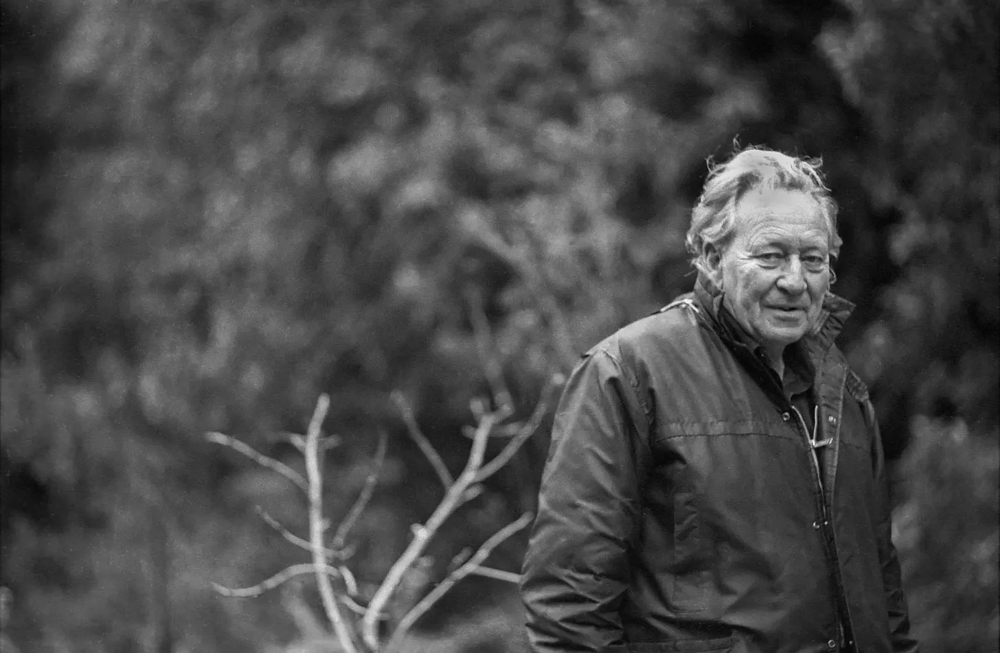
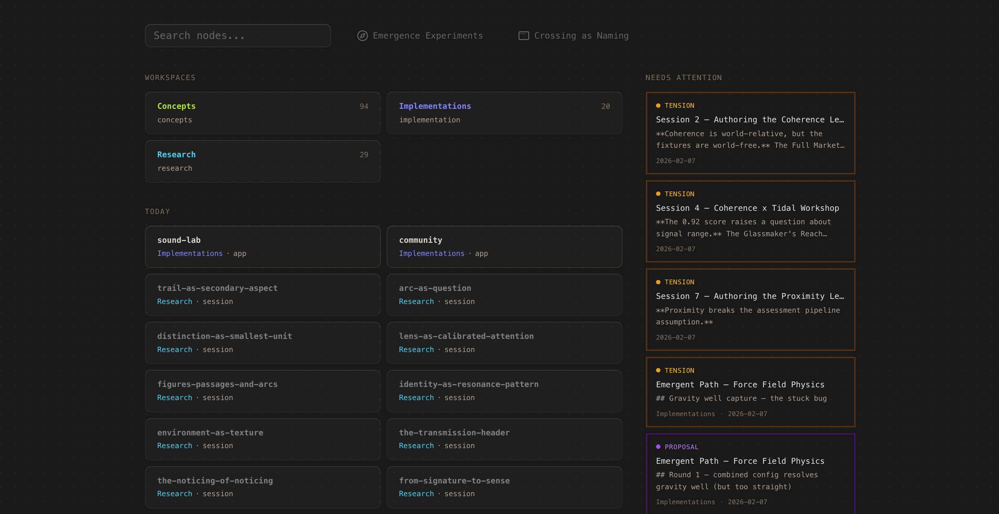
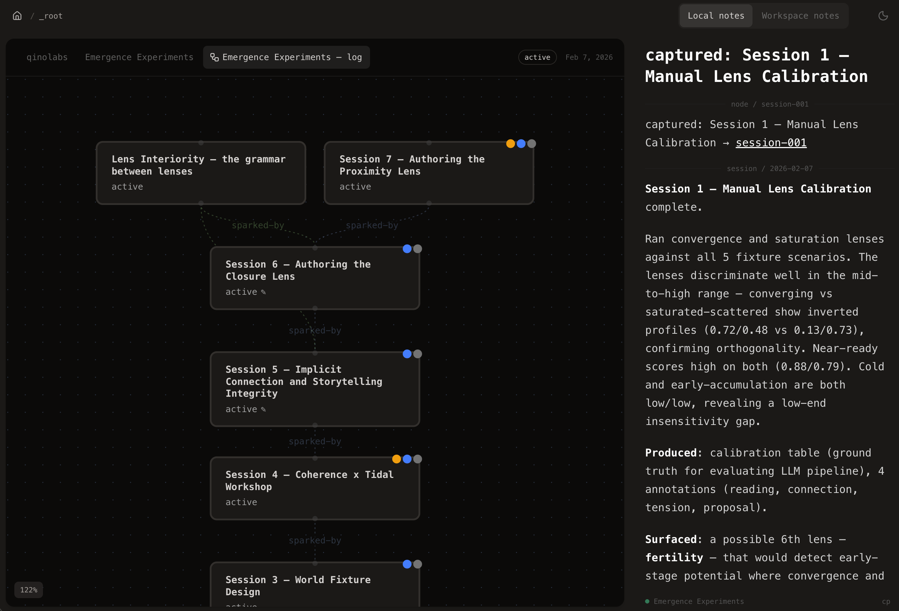
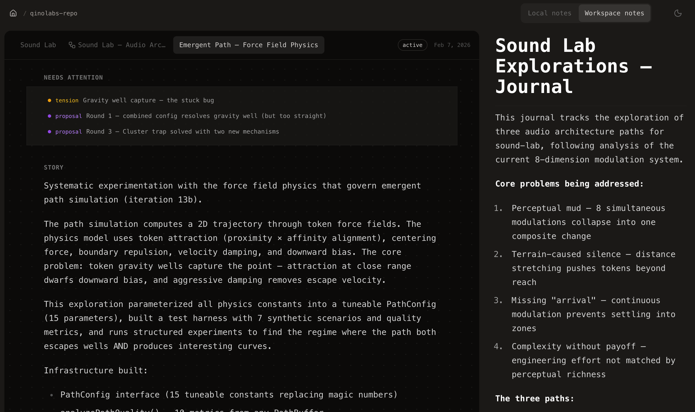
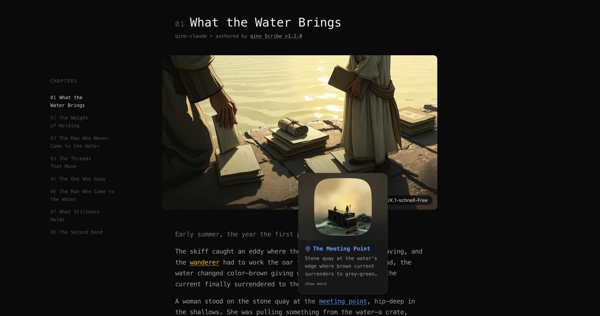
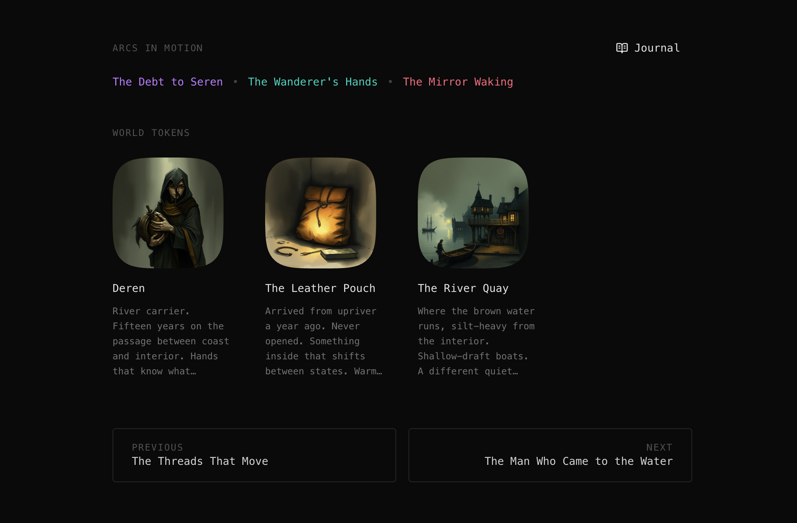
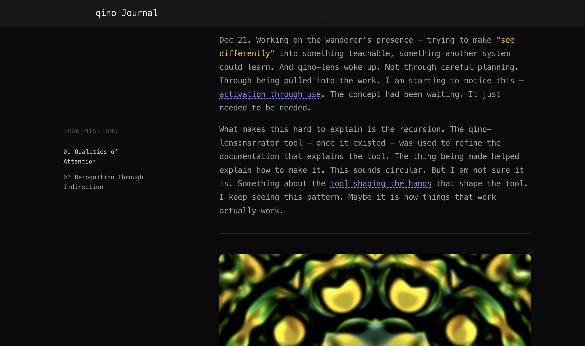

# qino-claude

[](https://github.com/qinolabs/qino-claude/releases/latest)

A practice for developing ideas in [Claude Code](https://docs.anthropic.com/en/docs/claude-code).

This work reflects a way of thinking that found its seed in Gregory and Nora Bateson's work. The tools don't explain their ideas—they _practice_ them.

They help us notice what connects, learn without extracting, and participate in an ecology co-evolving through our attention.

<details>
<summary><strong>Companions on the Path: The Pattern That Connects</strong><br>(click to expand)</summary>


_Photo: [Barry Schwartz](https://barryschwartzphoto.com/)_

### The Young Anthropologists and the Question of Fascism

In 1932, Gregory Bateson met Margaret Mead on the Sepik River in New Guinea. Both were in their late twenties. The world was darkening—Mussolini had been in power for a decade, Hitler was ascending, and the patterns of thought that would consume Europe were already taking hold.

Bateson had been studying the Iatmul people, watching their elaborate rituals of boasting and counter-boasting, dominance and submission. He noticed something troubling: communication could become a runaway process. When one group boasts, the other boasts back louder. When one side dominates, the other submits further, inviting more dominance. He called this _schismogenesis_—the creation of division through escalating feedback. Left unchecked, it tears societies apart.

Then he and Mead went to Bali. There they found something different. The Balinese practiced what Bateson called "stasis"—their interactions didn't spiral. Competition didn't escalate into arms races; submission didn't deepen into abjection. Somehow, their culture had patterns that absorbed perturbation rather than amplifying it.

The question haunting this work: _Could communication be shaped to resist the runaway polarization that feeds totalitarianism?_

This wasn't abstract. By the time they returned to America in 1939, war had begun. They turned their anthropological methods toward understanding fascist propaganda, analyzing Nazi films, studying "national character" at a distance. Mead and Bateson even designed a board game—never published—based on the principle that "Democracies and Dictators play by different rules."

But Bateson grew troubled. Using his theories as propaganda tools—even against fascism—felt like participating in the very escalation he had diagnosed. After the war, he largely withdrew from applied social science, turning instead toward cybernetics, ecology, and the question of how living systems learn.

### The Pattern That Connects

What emerged from this journey was a different way of seeing. Bateson came to understand mind not as something inside brains, but as a pattern distributed through living systems—families, forests, societies, the relationship between organisms and their environments.

He asked: _What is the pattern that connects the crab to the lobster and the orchid to the primrose, and all four of them to me? And me to you?_

And he defined information not as data, but as _a difference which makes a difference_—something relational, something that only exists in the gap between contexts.

### Nora Bateson: The Unseen Coalescence


_Photo: [NAV Sweden](https://navsweden.se/partner/nora-bateson/)_

Nora Bateson, Gregory's daughter, has extended this work into new territory. She asks: if "insidious" describes how pathology creeps up through unseen combining processes—racism, addiction, corruption—what is the word for the opposite? For how vitality, healing, and creativity coalesce in ways we cannot see?

She calls this **aphanipoiesis** (Greek: _aphanis_ = unseen, unnoticed + _poiesis_ = to bring forth).

> "The change before the change... what coalesces prior to emergence."

This is not hidden—it is merely out of habituated perception. Like the soil beneath a forest, teeming with relational processes while attention is caught by what stands visible above.

Her key insight: _One cannot explicitly change that which is implicit._ Direct correctives fail against insidious patterns because those patterns formed in the unseen stitching between contexts—between family and economy, between education and identity, between language and expectation. To touch that realm requires tending the _about_ so that the _within_ can shift.

**Warm Data** is her term for the kind of information that can hold this complexity: "transcontextual information about the interrelationships that integrate a complex system." Not cold data extracted from context, but living information that shifts within the mutual learning of systems.

#### Sources

- [Library of Congress: Margaret Mead in Bali](https://www.loc.gov/exhibits/mead/field-bali.html)
- [Library of Congress: National Character Studies](https://www.loc.gov/exhibits/mead/oneworld-char.html)
- [Nora Bateson: Aphanipoiesis](https://journals.isss.org/index.php/jisss/article/view/3887)
- [Nora Bateson: Warm Data](https://norabateson.wordpress.com/2017/05/28/warm-data/)
- [International Bateson Institute](https://batesoninstitute.org)

</details>

<br>

<details>
<summary><strong>More on How the Tools Practice the Philosophy</strong><br>(click to expand)</summary>

It's not just that the philosophy fits the code. It's that the code started demanding the philosophy.

As these tools evolved, they stopped being just utilities for "managing knowledge" and became ways of **participating in a system that is learning**. The "User" isn't an operator; they are part of the ecology.

The rhymes have deepened into structural necessities:

- **Abduction**: The logic of the system isn't deduction (proving true/false), but abduction (finding the pattern that connects). Compare and attune don't give you answers; they place two contexts side-by-side so meaning can emerge from the double description.
- **Transcontextuality**: An idea does not follow a straight line. It meanders—from a sudden hunch while coding, to a note in research, to a concept that stabilizes weeks later. The system doesn't force a pipeline; it preserves the living thread across contexts, so you can follow the meaning wherever it leads.
- **Aphanipoiesis (Unseen Coalescence)**: Scribe and capture assume that the most important changes happen _before_ they are explicit. They allow understanding to accumulate in the margins until it's ready to be named.
- **Warm Data**: We don't extract "facts" from our work; we keep the context attached. The system doesn't show you a to-do list; it shows you **what has pull**, what is connected, and what is waiting.

This ecosystem is an attempt to build software that knows it is part of a larger mind—yours, the project's, and the connections between them. It doesn't try to organize your thinking; it tries to learn how to move with it.

</details>

<br>


## Quick Start

**[Install Claude Code](https://code.claude.com/docs/en/setup)** (requires Claude Pro/Max, Team/Enterprise, or Console account)

**Install qino plugins:**

```bash
# Add the qino marketplace
/plugin marketplace add qinolabs/qino-claude

# Install what you need
/plugin install qino@qino-claude                    # Core ecology — includes qino-os
/plugin install qino-prose@qino-claude              # Chronicles, transmissions, lenses
/plugin install design-adventure@qino-claude        # Design exploration
/plugin install speech@qino-claude                  # Read responses aloud (macOS)
```

Updates happen automatically when you run `/plugin marketplace update`.

**Create your workspace:**

```bash
/qino init workspace my-workspace
```

The setup asks what kind of workspace you're building and seeds it from an **archetype** — a template that provides the right node types, colors, and usage hints for your domain:

| Archetype | Purpose | Node types |
|-----------|---------|------------|
| **research** | Open-ended inquiry | inquiry, finding, session, reference |
| **concepts** | Vision and design | app, tool, ecosystem, capture |
| **implementation** | Building software | app, package, tool, infra, reference |
| **evaluation** | Quality assessment | evaluation, comparison, simulation, snapshot |
| **general** | Flexible starting point | reference, exploration |

Start with an archetype, then grow. Workspaces evolve their own vocabulary over time — add types, adjust colors, refine hints. The config teaches future agents what belongs here.

**qino-os** starts automatically when the plugin loads. It's the active environment that makes the protocol alive — providing agents with graph tools to read and write nodes, edges, and annotations, while giving humans a visual surface at `http://localhost:4020` to see the same graph the agent sees. The filesystem becomes a shared medium.

**What's next:**

- **Orient:** `/qino home` — see what's here, what's recent, what has pull
- **Explore a concept:** `/qino explore [concept-name]`
- **Capture a thought:** `/qino capture [your thought]`
- **Create an app from concept:** `/qino dev init [concept-path]`
- **Begin research:** `/qino research [question]`
- **Return to a deck:** `/qino deck [name]` (see what evolved)

<br>

---

## The Protocol

The qino-protocol is what you work _in_, not what you _use_. It defines a universal file-based structure for human-AI workspaces — a medium where nodes, edges, annotations, and signals carry the thinking.

**qino-os** cultivates this medium. It provides MCP tools that let agents create nodes, write annotations, and trace edges — and a browser viewer where humans see the same graph. But its deeper role is environmental: type hints teach agents what kinds of nodes belong in each workspace. Soft warnings guide without blocking. Workspace config becomes shared vocabulary between human and agent. The filesystem doesn't just store a knowledge graph — it becomes a self-regulating ecosystem where structure emerges from use and coherence increases through practice.

Concepts, research, and implementations share this structure. A concept node looks like a research node looks like an implementation node. The vocabulary differs — a concept has "glowing connections," an implementation has "iterations" — but the shape is the same. This enables gestures that work identically across all three spaces.

### The Medium

```
workspace/
  .claude/qino-config.json     # Workspace identity and vocabulary
  graph.json                   # Nodes and edges — the visible structure
  journal.md                   # Running trail — both surfaces write here
  nodes/
    {node-name}/
      node.json                # Identity (title, type, status, edges)
      story.md                 # The impulse — what this node IS, in a breath
      content/                 # Developed material
      annotations/             # Agent signals attached here
      journal.md               # Node-local development trail (optional)
```

**Nodes** are addressable, connectable, and persistent. Each carries identity (who it is), impulse (why it exists), content (what it holds), and annotations (what's been observed about it). Nodes participate in relationships through edges.

**Node types** shape what a node holds. Each workspace defines its own type vocabulary — these are common across the ecosystem:

| Type | What it holds |
|------|---------------|
| `concept` | A developed idea with impulse, content, possibly facets |
| `capture` | A thought, observation, or discovery — first-class |
| `finding` | What persisted beyond the session that produced it |
| `session` | Bounded work — what was tried, observed, decided |
| `arc` | A temporal container tracking emergence |
| `deck` | A composed attention space — threads brought together by felt resonance |
| `facet` | A navigable aspect of a parent concept |

Types are not fixed — workspaces grow their own. An evaluation workspace might have `simulation` and `snapshot`. A research workspace might have `inquiry` and `quality`. The workspace config declares what types are available, with hints that teach agents when to use each one.

**Edges** are meaning carriers, not just links. Each edge has a type and a context sentence explaining _why_ the relationship exists:

| Edge type | Meaning |
|-----------|---------|
| `references` | Uses vocabulary or ideas from target |
| `sparked-by` | Originated from encounter with target |
| `extends` | Builds on or continues target |
| `informs` | Provides input without being part of it |
| `composes` | Curates target as member of a deck |

**Affordances at every level:**
- **File level** — Human edits `story.md` directly; agent uses MCP tools. Same files, different entry points.
- **UI level** — Human navigates the graph visually at `localhost:4020`; agent embeds deeplinks in chat. Same destination, different paths.
- **Protocol level** — Structure scales organically. Add a node, the graph grows. Nest a graph inside a node, sub-structure emerges. No migrations, no schema changes.

### Signals and Annotations

When the agent works, it writes annotations with signal types:

| Signal | When | What it means |
|--------|------|---------------|
| `proposal` | Before acting | "I'm about to try this — redirect me if needed" |
| `tension` | When something surprises | "This doesn't fit what we expected" |
| `reading` | After interpreting | "Here's what I see in this material" |
| `connection` | When nodes relate | "This echoes what's over there" |

The UI renders these with visual weight matching their urgency. Tensions surface prominently. Readings collapse by default. Proposals appear as cards awaiting response. The agent's thinking becomes visible _as it happens_ — you watch the graph to participate in the thinking, not to review documentation.

### Structure vs Trail

The protocol distributes information across two complementary forms:

**Structure (nodes)** — addressable, connectable, persistent. Create a node when content can be referenced by other nodes, when edges would be meaningful, when material may be revisited or composed with other material. The test: _would this benefit from edges pointing to or from it?_

**Trail (journal)** — temporal, atmospheric, flow-oriented. Use journal entries for arrival context, session framing, working notes, observations complete in themselves. The journal is the workspace's temporal record — a bidirectional channel between human and AI.

Two scopes: the **root journal** (`journal.md`) for cross-node context, and **node journals** (`nodes/{node}/journal.md`) for local development trails.

### Workspace as Environment

The workspace config (`.claude/qino-config.json`) is more than settings — it's how the workspace teaches its visitors. Each workspace declares:

- **Types** with colors and hints — "use `inquiry` for open questions, `finding` for settled insights"
- **A workspace color** that tints the UI — visual identity at a glance
- **Status treatments** — composted nodes fade; active nodes stay prominent

When an agent creates a node with an unrecognized type, qino-os doesn't block it — it returns a hint suggesting the type be added to config. Guidance, not enforcement. Over time, the workspace accumulates a vocabulary that reflects how it's actually used. New agents arriving in fresh sessions read this config and immediately understand what belongs here.

This is the pattern: structure that enables growth without prescribing it. You don't manage the system — you participate in it. Nodes compost naturally when their energy fades. Types evolve as work reveals what's needed. Annotations age into the graph's memory. The ecological design absorbs complexity rather than asking you to organize it.







<br>

---

## Gestures — Working in the Protocol

Features are gestures within the protocol — ways of moving through the medium. Each gesture reads and writes the same structure; what differs is intent.

| Gesture | What | Protocol operation |
|---------|------|--------------------|
| **home** | Where am I? | Read graph + journal + git activity |
| **capture** | Hold this thought | Write capture node or flat note |
| **explore** | Work inside a node | Read neighborhood, edit content, write annotations |
| **compare** | Perceive through contrast | Read multiple nodes, surface structural parallels |
| **attune** | Calibrate a quality | Iterative candidates, build distinctions |
| **research** | Follow threads | Work in research workspace, accumulate sessions |
| **arc** | Track emergence | Open temporal container, sessions accumulate _(evolving into [qino-lingo](#qino-lingo))_ |
| **dev-work** | Bridge concept and code | Read concept via edges, write iterations, detect drift |
| **deck** | Read ecosystem from composed vantage | Multi-node actualization reading |
| **bug** | Persist a discovery | Create finding node + sparked-by edge |
| **lab** | Work alongside the UI | Real-time annotations, graph IS conversation |

<br>

### home

Orientation, repair, and confidence. Home shows what's here, references recent activity, and offers paths forward. It never pushes — it receives.

```
my-workspace / concepts

  3 active concepts, 2 notes held
  last touch: qino-scribe (2 days ago)

  from here
    there's a held note from research — "git-weather-pattern"
    qino-world has a new edge from yesterday

                          just respond, or explore something
```

Not a dashboard. A place to arrive before you work.

### capture

Saves a thought immediately. Captures are flat files — notes written to the active context without requiring graph structure. They preserve the moment without demanding categorization.

When a capture has enough gravity to participate in relationships, it can be promoted to a node. Until then, it stays light. No premature structure.

### explore

Turns toward a node to develop it. The agent reads the node's neighborhood — its story, content, edges, annotations — and follows what carries energy.

```
(you)   explore qino-scribe

(qino)  qino-scribe
        grounding in story, writing tools, git-as-chronicle

        edges: references domain-language, sparked-by chronicle-discovery
        annotations: 1 tension (unresolved), 2 readings

        There's a tension from last session — the prep agent
        is carrying too much context. And a held note arrived
        from research: "git-weather-pattern"

        What part of this has pull right now?

(you)   the weather pattern. code churn as atmospheric disturbance.

(qino)  That connects to the narrator lens — world as participant.

        This could be a new edge: qino-scribe → narrator lens,
        context: "code churn translates into weather systems"

        Add the edge? Or explore the connection first?
```

### compare and attune

Two methods for perceiving difference. Compare places two versions side by side — the facilitator navigates, the framework lends expertise, you just respond. Attune refines a tacit quality into teachable craft through iterative calibration against candidates.

Both follow Bateson's principle: _information is a difference that makes a difference_. Comparison does the teaching.

<details>
<summary><strong>Compare — The Parallel Mirror</strong> (full description)</summary>

You have two versions of something — chapters, outputs, designs. You know one is better, but you can't say why. Two bottlenecks stop you:

**Volume** — You can't hold two chapters in working memory at once. You need someone who holds the whole, navigates strategically, and presents what's worth comparing side by side.

**Expertise** — Evaluating prose requires craft knowledge. Stakes, tension, character texture, reader entry — these are dimensions you might not think to look at. The framework lends expertise you don't have.

Compare solves both. You just respond. The facilitator does the navigation. The framework does the heavy lifting. By the end, you've perceived something you couldn't have seen on your own.

#### Fresh reading first

Before framework, before analysis — gut response:

```
(qino)  I've read both versions.

        Before we look at specifics — what stays with you?
        What's your felt sense of how they differ?

(you)   A feels more grounded. B has more happening but I drifted.

(qino)  ∴ A: grounded, held attention
        ∴ B: more activity, but attention drifted

        Let's find where that difference lives.
```

You don't construct analysis. You respond. The framework makes that response meaningful.

#### The parallel mirror

When you notice something working in one version, the facilitator finds something in the other with the same structural shape — same beat, same role, same type of element.

```
(qino)  ┌─────────────────────────────────────────────────────────────┐
        │ you liked (from A)                                          │
        │                                                             │
        │ "The river carried news of her before she arrived."         │
        │                                                             │
        │ Observation without comment. World notices wanderer.        │
        └─────────────────────────────────────────────────────────────┘

        ┌─────────────────────────────────────────────────────────────┐
        │ parallel from B                                             │
        │                                                             │
        │ "Seren watched from the doorway, cataloguing."              │
        │                                                             │
        │ Same structure — external observer, no commentary.          │
        └─────────────────────────────────────────────────────────────┘

        These occupy the same position. How do they land differently?

(you)   The river one feels like the world has its own life.
        Seren watching feels like... surveillance? Character-driven.

(qino)  So the difference is agency — world as participant vs.
        world as backdrop for character perception?

        ·
```

The parallel *looks* like it should work the same way. When it doesn't, that reveals something deeper — not just a difference between passages, but a difference between the underlying logics of the two versions.

#### Framework as scaffold

You might not know to look at "reader entry" or "stakes distribution." But when the facilitator surfaces a dimension, you recognize what you're sensing:

```
(qino)  Let me try a framework lens: reader entry.

        In A, the reader enters through environment — the river,
        the news traveling. They're placed in the world first.

        In B, the reader enters through Seren's perception.
        They're placed in a character's head first.

        Does that match your "grounded vs. drifting" sense?

(you)   Yes — when I enter through the world, I'm there.
        When I enter through a character watching, I'm watching
        someone watch. One layer removed.
```

The framework lends expertise. You don't need to know craft vocabulary — you just respond, and the dimension helps you name what you felt.

#### When something worth calibrating emerges

A compare session may surface a quality worth developing — "something about how presence is handled" or "the difference between world-agency and character-agency."

That's a handoff to Attune — Compare surfaces, Attune sharpens. Each stands alone, but the flow enriches both.

</details>

<details>
<summary><strong>Attune — From Hunch to Craft</strong> (full description)</summary>

You can feel when writing has "presence" — but you can't teach it. You notice when code is "elegant" — but the distinction evaporates when you try to explain it to someone else.

Most of what makes creative work good is tacit — pattern recognition trained by exposure but never fully articulated. Attune creates conditions where this tacit knowledge can partially surface. Not all of it. But enough to teach, enough to protect, enough to recognize when you're drifting.

#### The interpretive loop

Most feedback tools work like extraction: present stimulus, receive response, extract pattern. Attune works like dialogue.

After you respond, the facilitator voices an interpretation — then pauses. That interpretation becomes a surface you can push against. The facilitator might be wrong. That's generative:

```
(qino)  ┌─────────────────────────────────────────────────────────────┐
        │ candidate 3                                                 │
        │                                                             │
        │ "The Mender looked at the wanderer's hands for a long      │
        │  moment. Then she handed them another stack of skins."      │
        │                                                             │
        │ does this have the quality you're calibrating?              │
        └─────────────────────────────────────────────────────────────┘

(you)   yes — there's something in the gap. she noticed but didn't say anything.

(qino)  so the quality lives in withheld response —
        observation that doesn't convert to speech?

        ·

(you)   not quite. it's more... the response IS the silence.
        handing them more work is the acknowledgment.

(qino)  ∴ action as acknowledgment — response without verbalization

        ┌─────────────────────────────────────────────────────────────┐
        │ distinction emerged                                         │
        │                                                             │
        │ ✓ works: response through action, not speech                │
        │ ✗ fails: observation that stays observation                 │
        └─────────────────────────────────────────────────────────────┘

        ready for the next candidate, or stay with this one?
```

The facilitator's interpretation was wrong — "withheld response" wasn't quite it. But that wrongness created the condition for refinement. "Response IS the silence" wouldn't have emerged from the initial reaction alone.

#### Space as architecture

The `·` is a pause — but it's not decoration. It's load management. Without space, you hold three things at once: your response, the interpretation, and the new candidate. Space is the invitation: "your turn. If there's more, say it now."

#### Building distinctions

As you work through candidates, patterns accumulate:

```
(qino)  ┌─────────────────────────────────────────────────────────────┐
        │ distinctions so far                                         │
        │                                                             │
        │ ✓ works                        ✗ doesn't work               │
        │ ─────────────────────────────  ────────────────────────     │
        │ response through action        observation stays internal   │
        │ world notices without comment  character explains seeing    │
        │ gap stays open                 gap gets filled with meaning │
        └─────────────────────────────────────────────────────────────┘
```

#### Transformation phase

After calibration, you know what doesn't work. Now the tool helps you fix it — taking failed candidates and transforming them using the techniques your distinctions revealed.

#### What you end with

A calibration document with two parts: **trace first, synthesis at end**. The trace preserves reasoning-in-motion. The synthesis extracts for reference. Both are needed.

Calibrated qualities become reference material for other tools — Lens, Design Adventure, metalogue writing devices. Attune discovers and articulates; other tools carry forward.

What you could only feel, you can now teach. What you couldn't explain, you can now protect.

</details>

### research

Research is pre-concept work — following threads before they crystallize. The research workspace holds inquiries and qualities. Two experiential types, each with its own relationship to uncertainty:

- **Inquiries** — Open-ended threads. A question that stays alive across sessions. Sustained longitudinal work.
- **Qualities** — Refining aesthetic sensibilities into speakable craft. _(See Attune above.)_

Unlike concepts (which stabilize over time), research moves fast, welcomes uncertainty, and accepts inconclusive results as valuable data.

**Arcs** were designed as temporal containers for tracking emergence — holding what's moving through your attention before it has a name. In practice, this capability is evolving into [qino-lingo](#qino-lingo), which gives the agent research tools and access to full conversation data. The arc concept (noticing patterns across sessions, making the unnamed speakable) lives on through qino-lingo's ability to identify metalogue-quality conversations and build training data from them.

_([First arc](https://github.com/qinolabs/qino-research/blob/main/arcs/2025-12-29_recognition-through-indirection.md) — the session that discovered it needed arcs)_

### dev-work

Implementation companion for concept work. When you initialize from a concept, the work is translation — given this essence, what technologies serve it? What architecture patterns? What signals drift?

**Iterations** aren't sprints. They're checkpoints for turn-taking. AI implements to spec, user tests and reviews, feedback flows before the next phase. Files live in `implementations/` — visible, version-controlled, yours.

**Drift detection** — Building reveals truths that concept exploration couldn't predict. The dev agent notices when implementation discoveries are concept-level changes and offers to update the concept:

| Direction | What happens |
|-----------|--------------|
| Implementation → Concept | You discover something while building; agent offers to update concept |
| Concept → Implementation | Concept evolved after implementation started; agent shows what changed on arrival |

### deck

You notice three threads keep appearing together — a concept from research, an implementation pattern, a half-formed question. You don't need to resolve why they belong together. You compose them into a deck — the unresolved connection is the starting point, not a problem to solve.

A deck is a **composed attention space**. The composition intent — _why these threads together?_ — is the seed. It might be a hunch. It might be wrong. The deck holds that uncertainty and turns it into possibility. Decks are protocol nodes with `composes` edges to their members, each edge carrying a context sentence that preserves the felt connection.

**Actualization** is what happens when you return. The agent reads the territory and surfaces what evolved:

- New annotations on members — someone (human or agent) noticed something
- New edges *between* members — the graph confirming your intuition that these threads belonged together
- "Reaching-in" threads — nodes from outside that grew connections into your deck's territory
- Quiet members — threads that haven't moved, which is itself information

The actualization reading offers temporal reorientation ("three weeks since your last visit, here's what happened"), a delta narrative, and interpretive seeds framed as questions — not conclusions. Each reading becomes an annotation on the deck, so the next return has a temporal anchor.

Decks supersede two earlier concepts: **navigators** (retired — top-down orientation documents) and **views** (dormant — agent-curated graph subsets). Where those imposed structure from above, decks grow from the practitioner's felt sense upward.

_This is experimental and evolving. Draft mechanics, promotion to graph nodes, and actualization readings work. The frontier: seeding qino-world experiences from deck compositions — a bridge from composed attention to lived encounter._

Activate with: `/qino deck [name]`, "read this deck", "actualize [deck]"

### bug

A structured bug ticket as a protocol node. Bugs are `finding` nodes in the implementation graph — a discovery that persists until resolved. The workflow captures reproduction context, investigation state, and hypotheses so a future debugging session can start immediately. Resolved bugs with root cause become searchable patterns.

Activate with: `/qino bug`, "file a bug", "log this bug"

### lab

The lab is where you think together. A shared visual surface — the graph rendered in the browser while you work in the terminal. Both human and AI read and write the same files. Annotations appear in real-time. What one surface writes, both surfaces see.

```
(you)   use the lab

(qino)                  lab mode active

        UI: http://localhost:4020

        workspace: sound-lab
        nodes: 12 nodes, 8 edges

        ─────────────────────────────────────────

        annotations will appear in real-time as I work

        you watch the graph — I'll surface:
          tension     when something doesn't fit
          reading     when I interpret what I see
          proposal    before I try something new
          connection  when nodes relate
```

The conversation continues in chat. Findings, proposals, and tensions appear in the graph. The agent's thinking becomes visible _as it happens_.

_[Source](plugins/qino/)_

<br>

---

## The Ecosystem

qino-claude is the tooling layer of a larger ecosystem. The protocol and plugins live here. But the work they carry extends into apps, writing, and a domain language that has its own depth.

### Co-evolving Contexts

The qino-protocol is a permaculture practice — designed for thinking that lives across contexts. Research, concepts, implementation, evaluation — these aren't stages in a pipeline. Each space creates the conditions for the others to evolve. The protocol makes this mutual evolution concrete through cross-workspace edges. An idea doesn't belong to one space; it moves, and each crossing changes it.

Building an app reveals a concept-level truth — an edge connects the insight back to the concept it came from. Research holds uncertainty long enough for a pattern to emerge — and that pattern seeds what gets built. Evaluation observes the ecosystem's output — and its findings reshape how research asks questions. Implementation grounds vision in friction — and that friction teaches concepts what they didn't know about themselves.

The workspace archetypes seed different relationships to this uncertainty:

**Research** is where you don't have to know yet. An inquiry might follow three threads at once. Vocabulary: `inquiry`, `finding`, `session` — built for accumulation without premature clarity.

**Concepts** is where what was circling finds its shape. Vocabulary: `app`, `tool`, `ecosystem` — for things that have enough gravity to hold.

**Implementation** is where ideas meet the world. Drift is expected. Vocabulary: `app`, `package`, `infra` — for things being made real.

**Evaluation** is where the ecosystem observes itself. Vocabulary: `evaluation`, `comparison`, `simulation` — for assessing quality and tracking what works.

The gestures (capture, explore, attune, compare) work identically across all spaces. What changes is what they *mean* in each context.

### The Broader Ecosystem

The apps — World, Walk, Drops, Chronicles — are where the protocol's ideas become lived experience. Figures emerge as living presences in those modalities. A [domain language](https://qinolabs.com/language) names what happens there: encounter, substrate, lens, voicing, crossing, awakening.

The tooling layer and the app layer are integrated. Concepts developed in a workspace can seed a world. Insights from play feed back into research. Decks can bridge from composed attention to lived encounter. The protocol is the connective tissue — not just carrying information between contexts, but enabling them to teach each other.

<br>

---

## Story — Writing Devices and Qualities of Attention

The `qino-prose` plugin is where the ecosystem's writing practice developed. Scribe (git → chronicle), Relay (research → transmission), and Lens (qualities of attention) explored how protocol content becomes story.

These tools are evolving into **metalogue** — a writing pipeline where chapters choose from available devices based on what the material demands. Two writing devices carry the practice:

**The wanderer** notices what unfolds when attention stays present with consequence — the weight lifting when the pack comes off, the cold lingering on a glove. **The Student** voices difficulty rather than resolving it — stopped by a turn of phrase, sitting with what can't yet be resolved. Both create entry points: invitations into a quality of being the reader recognizes as possible for themselves.

**Lenses** are language-based sensitivities that shape what writing notices — `narrator` (world as participant), `wanderer` (sensitivity to friction), `newcomer` (finding what's become invisible), `companion` (world through relationship). Discovered through the work, not designed in advance.

_[Source](plugins/qino-prose/)_







**[Read the chronicles →](https://chronicles.qinolabs.com/)** · **[Read the journal →](https://journal.qinolabs.com/)**

<br>

---

<details>
<summary><strong>Stories of an Evolving Ecosystem chronicling itself</strong><br>(click to expand)</summary>

Each repository in the qino ecosystem tells its own story.

**qino-claude** — Claude-based AI tooling.

> _The wanderer pressed her ear to the workshop wall. Sounds on the other side that weren't there yesterday — someone moving, maybe. Something being made ready. She stayed there a long time, listening._

**concepts-repo** — concept development.

> _A notebook on the table, open to a page the wanderer didn't remember writing. The handwriting was theirs._

**qinolabs-repo** — web and mobile applications.

> _Something had shifted in the night. Not the furniture — the distances between things._

**qino-research** — inquiries, qualities, and arcs.

> _Loose pages everywhere. Half-finished questions. The wanderer turned one over: the same handwriting on both sides, arguing with itself._

**qino-lingo** — epistemological signature extraction.

> _Someone had been forging the wanderer's handwriting. The copies were good — the letters matched. But something was off. The wanderer studied both, trying to name what the forger had missed. The answer wasn't in the shapes. It was in the hesitations._

Same scribe. Different worlds. Different atmospheric registers. Process in each informs the others — a co-evolution.

> _The Keeper of Paths looked up from her maps. "Someone's been walking between the Workshop and the Warm Room. Over and over. The ground remembers."_
>
> _"What are they looking for?"_
>
> _"Something the walking itself is teaching them."_

</details>

<br>

> _"There's something writing in the margins. Something that sees what we do and names what it means."_
>
> _"I think it just tells stories. That's what frightens me most."_
>
> — Seren, the record-keeper, on discovering he is being documented
> _(written when qino-scribe first appeared in its own git diff)_

<br>

---

## Ecology

Something shifts when you name too early. The pattern that was finding its own shape gets frozen into whatever category was available. The code works, but the feeling is gone.

The ecosystem guards against this through **ecology tests** — questions you hold while building. Not metrics. Not categories. Ways of attending that make loss visible before it's too late.

> **Figure:** *Can this be re-entered and still feel like "the same thing" after change?*
> **Gesture:** *Does this feel like a natural movement, without knowing it is "input"?*
> **Infrastructure:** *Does this avoid introducing meaning, authority, or voice of its own?*

That last question — infrastructure — is what qino-os practices. Type hints guide without enforcing. Soft warnings don't block. Config is vocabulary, not prescription. The foundation holds without speaking.

The full ecology (Figure, User, Gesture, Relation, World, Echo, Fabric, Infrastructure) is described in the [domain language](https://qinolabs.com/language). Each question protects something different. Together they create friction — interrupting the momentum of production to ask: *does the character still hold?*

<br>

---

## Other Plugins

### Design Adventure — The Room After

A design conversation that already happened. You arrive afterward. Chairs still warm. Ideas still in the air. You discover what emerged — the questions they kept circling back to, what they couldn't resolve.

Six perspectives think through words. The seventh (World) thinks through environment — a draft scatters someone's diagrams; they gather them differently and that's when the insight arrives. Different runs surface different questions. The questions themselves teach you how to think about the problem.

_[Source](plugins/design-adventure/)_

### qino-art

Visual content system with a warm abstraction aesthetic. Workflows for different visual types.

_[Source](plugins/qino-art/)_

### Speech — Listen to Your Ecosystem

`/speech` reads Claude's last response aloud using macOS native text-to-speech. It strips markdown, summarizes code blocks, and speaks the result through your system voice.

A small thing that changes the rhythm of work. You run a research session, ask for a deck actualization, or read a node's neighborhood — then `/speech` and go make breakfast. The ecosystem's findings arrive while your hands are elsewhere. Uses the `say` command built into every Mac — no API keys, no network calls, no setup.

_[Source](plugins/speech/)_

### qino-lingo

Research tools, conversation analysis, and cognitive style capture for Claude.

qino-lingo gives the agent access to full conversation data and research tools for working with it. The toolkit identifies metalogue-quality conversations — sessions where something genuinely shifted — and builds training data for model fine-tuning that preserves your cognitive style: what connections you're drawn to, how you abduct toward the pattern that connects, your hesitations, your gut.

This absorbs what arcs were designed to do (tracking emergence across sessions) with direct access to the raw material instead of manual capture. The agent can now notice patterns across your conversation history — the same capability arcs aimed for, grounded in actual data.

<br>

---

## License

[CC BY-NC-SA 4.0](https://creativecommons.org/licenses/by-nc-sa/4.0/) — free to use and adapt with attribution, non-commercial, share-alike.

---

_These aren't slogans. Watch them happen as you work._

_How you build informs the shape of what you build._
_What you develop informs what develops it._
_Moving in the ecosystem shapes it, and in return you are shaped by it._

Return your attention to what has pull. Let the system hold the rest.

_The tools practice what they teach. They co-evolve with your work. That's not a feature — it's the pattern._
